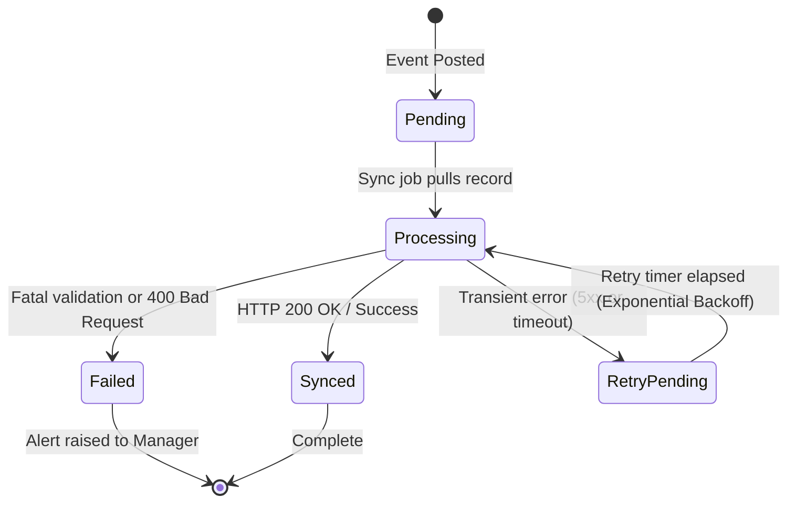

# Story 26.3-E: Supplier Return Debit Note / Accounting Outbox Planning Scope Lock

**Date**: 2026-05-18  
**Status**: Planning Only / Scope Locked  
**Implementation Phase**: Not Started  
**Target Epic**: Epic 26 — Advanced Supply Chain, Expiry Tracking & Automated Procurement

---

## 1. Goal
Define the precise business rules, data contracts, mapping specifications, idempotency criteria, and orchestration behaviors for converting a posted **Supplier Return (RMA)** into a **Debit Note / Supplier Credit Memo** event and queueing it securely inside the **Accounting Outbox** pipeline for eventual sync to QuickBooks Online (QBO).

This planning lock ensures that reverse logistics financial mutations remain asynchronous, transactionally isolated, and immune to duplication or external service latency.

---

## 2. Scope Lock Boundaries

To enforce high-fidelity integration borders and avoid sprawl into AP operations, this story adheres strictly to these boundaries:

### 📥 In Scope for Story 26.3-E Series:
*   **Debit Note Payload Contract**: Formulating the precise, normalized JSON representation of the returned goods value, taxes, and supplier metadata.
*   **Accounting Outbox Handoff**: Hooking into the successful post-mutation transaction of `SupplierReturnPostingService` to atomically create the `AccountingOutbox` entry.
*   **Supplier Credit Memo Mapping**: Specifying the translation of fields from the IPOS Debit Note payload into the QBO `VendorCredit` entity payload (distinguishing QBO `VendorCredit` for AP from QBO `CreditMemo` for AR).
*   **Idempotency & Collision Constraints**: Defining distinct uniqueness hashes that prevent duplicate postings at the queue and API gateway layer.
*   **Linkage Schema**: Connecting the immutable `supplier_returns` table with corresponding `accounting_outbox` UUID records.
*   **Audit, Retries & Error Categorization**: Creating an error taxonomy for failed sync attempts (auth, network, validation) and establishing backoff retry intervals.
*   **Pre-Implementation Test Scenarios**: Drafting comprehensive, red-phase test criteria to drive direct execution.

### 🚫 Explicitly Out of Scope:
*   **Direct AP Disbursements & Payments**: IPOS will **never** manage cash disbursements, bank account reconciliations, or actual payments to suppliers inside these modules.
*   **Supplier Balances / Ledgering**: The system does not maintain general ledger ledgering for supplier balances; all historical credit balances must live in QuickBooks.
*   **Direct API Transmission / Emailing**: suggestions are pushed solely to the outbox queue; no direct email transmission of PDF debit notes to the vendor is executed.
*   **PDF/Print Templates**: Design and rendering of print/PDF layouts for debit notes are deferred to a separate front-end/reporting slice.
*   **Manual Outbox Editing**: The generated payload is immutable and cannot be manually modified by system managers.

---

## 3. Debit Note Payload Structure

When a Supplier Return is posted, a normalized, self-contained JSON snapshot is compiled. This ensures that even if products, suppliers, or taxes are edited in the active database later, the historical integration record remains completely accurate:

```json
{
  "document_type": "supplier_credit",
  "document_number": "RMA-MNL-20260518-0001",
  "occurred_at": "2026-05-18T11:15:30Z",
  "supplier": {
    "id": "019e3ac6-26a7-717c-9849-f4d91ac7b1eb",
    "code": "COCA",
    "name": "Coca-Cola Bottlers Corp"
  },
  "branch": {
    "id": "019e3ac6-26db-72b0-935e-81762ae73c27",
    "code": "MNL"
  },
  "currency": "PHP",
  "financials": {
    "subtotal": "40.0000",
    "tax_total": "0.0000",
    "total": "40.0000"
  },
  "lines": [
    {
      "product_id": "019e3ac6-26dc-7074-8c13-071b26cf0bf0",
      "sku": "SKU-COCA-330",
      "description": "Coca Cola 330ml Can",
      "quantity": "4.0000",
      "unit_cost": "10.0000",
      "line_total": "40.0000"
    }
  ]
}
```

---

## 4. Accounting Outbox Handoff Behavior

To prevent partial failures (such as inventory deducting but no outbox record created, or vice-versa), the outbox handoff must execute **inside the same database transaction** as the RMA posting:

```
                  ┌─────────────────────────────────────┐
                  │ SupplierReturnPostingService::post  │
                  └──────────────────┬──────────────────┘
                                     │
                        [ Start DB Transaction ]
                                     │
                  ┌──────────────────▼──────────────────┐
                  │ 1. Deduct Inventory & Expiry Lots   │
                  │ 2. Recalculate High-Precision WAC   │
                  │ 3. Mark RMA Status = 'posted'       │
                  └──────────────────┬──────────────────┘
                                     │
                   ┌─────────────────▼─────────────────┐
                   │  Has outbox record been created?  │
                   └─────────────────┬─────────────────┘
                                     │
                             [ NO / NOT YET ]
                                     │
                  ┌──────────────────▼──────────────────┐
                  │ 4. Build Debit Note JSON Payload    │
                  │ 5. Write to `accounting_outbox`     │
                  │    - Available At: now()            │
                  │    - Sync Status: 'pending'         │
                  └──────────────────┬──────────────────┘
                                     │
                        [ Commit DB Transaction ]
                                     │
                  ┌──────────────────▼──────────────────┐
                  │ 6. Return success; queue sync job   │
                  └─────────────────────────────────────┘
```

---

## 5. Supplier Credit Memo QuickBooks Mapping

QuickBooks Online (QBO) does not use `CreditMemo` entities for supplier accounts. Instead, AR uses `CreditMemo` and **AP uses `VendorCredit`**. 

The outbox sync processor must build the payload using the `VendorCredit` resource scheme:

### Field-Level Translation:
| QBO VendorCredit Field | Source Field / Resolver | Mapping Logic |
| :--- | :--- | :--- |
| **DocNumber** | `payload.document_number` | Direct map (e.g. `RMA-MNL-20260518-0001`). |
| **VendorRef** | `payload.supplier.id` | Resolved via `AccountingMapperInterface->mapSupplier($supplierId)`. |
| **APAccountRef** | System Tenant Mapping | Maps to Accounts Payable liability account. |
| **TotalAmt** | `payload.financials.total` | Rounded to 2 decimal places using `round($total, 2)`. |
| **PrivateNote** | Composite | `"IPOS Supplier Return Debit Note " . payload.document_number`. |
| **Line** | Array of lines | Maps as **`ItemBasedExpenseLineDetail`** lines. |

### Product Line Translation (ItemBasedExpenseLineDetail):
```json
{
  "DetailType": "ItemBasedExpenseLineDetail",
  "Amount": 40.00,
  "ItemBasedExpenseLineDetail": {
    "ItemRef": {
      "value": "QBO_PRODUCT_ITEM_ID_MAPPED"
    },
    "Qty": 4.0000,
    "UnitPrice": 10.00
  }
}
```
*   `ItemRef` must be resolved using `AccountingMapperInterface->mapProduct($productId)`. If no product mapping exists, sync fails with a validation category error.

---

## 6. Idempotency & Collision Prevention

To prevent posting duplicates if the sync daemon experiences timeouts or gets retried, strict idempotency is enforced at two layers:

1.  **IPOS Table Level**: A unique composite index on the `accounting_outbox` table:
    ```sql
    UNIQUE(tenant_id, event_type, source_type, source_id)
    ```
    This prevents the same Supplier Return from registering multiple outbox messages.
2.  **QuickBooks Payload Level**: Generating an `idempotency_key` header/property:
    ```
    ipos:{tenant_id}:vendor_credit:{supplier_return_uuid}
    ```
    This key is sent with the QBO API request, allowing the QBO API Gateway to safely reject identical requests within 24 hours.

---

## 7. Audit, Retry & State Machine

Every outbox sync event progresses through an audit-tracked state machine:



### A. Failure Classification
When the sync attempt fails, `AccountingOutboxProcessor` must categorize the exception:

| Category | Typical Status Code / Error | System Reaction |
| :--- | :--- | :--- |
| **`validation_failure`** | QBO 400 Bad Request, missing mappings, structural errors. | Status set to `failed`. Permanent rejection. Halt retries. Log audit alert. |
| **`auth_failure`** | 401 Unauthorized, expired OAuth tokens, invalid client credentials. | Status set to `pending`. Pause processing for this Tenant's queue immediately. Dispatch tenant alert. |
| **`network_failure`** | 502 Bad Gateway, 504 Gateway Timeout, connection reset. | Increment `attempt_count`. Set status to `pending`. Schedule next retry. |

### B. Exponential Backoff Formula
Retry intervals back off progressively to avoid hammering vendor APIs during outages:

$$\text{Retry Delay} = 2^{\text{attempt\_count}} \times 5 \text{ minutes}$$

*   **Max Attempts**: 5 attempts. If reached, transition record status to `failed` and log a high-priority system alert.

---

## 8. Test Matrix for Implementation Verification

These pre-implementation validation specifications will be coded as red-phase test cases to verify the correctness of the integration:

| Test ID | Level | Target Domain | Scenario Description | Expected Outcome |
| :--- | :--- | :--- | :--- | :--- |
| **TC-26.3E-01** | Unit | Outbox Writing | Return is posted successfully | `accounting_outbox` record created with status `pending`, type `supplier_return_posted` inside the same transaction. |
| **TC-26.3E-02** | Unit | Immutability | Attempt to modify `payload` on outbox record | `RuntimeException` thrown. Record remains immutable. |
| **TC-26.3E-03** | Unit | Payload Schema | Verify JSON format of the outbox payload | Match the specified structure (subtotals, totals, supplier codes, SKU, quantities, and cost). |
| **TC-26.3E-04** | Integration | QBO Mapping | Build QBO payload from outbox record | Correctly map to QBO `VendorCredit` entity with `ItemBasedExpenseLineDetail` containing mapped product references. |
| **TC-26.3E-05** | Integration | Unmapped Products | Product lacks QBO item mappings | Sync fails with validation error category, status set to `failed`. |
| **TC-26.3E-06** | Integration | Unmapped Supplier | Supplier lacks QBO vendor mappings | Sync fails with validation error category, status set to `failed`. |
| **TC-26.3E-07** | Integration | Idempotency | Attempt to insert duplicate return outbox entry | SQL Integrity Exception or handled block; duplicate prevented. |
| **TC-26.3E-08** | Integration | Retry Backoff | Simulate transient connection drop | Attempt count increments, `next_attempt_at` correctly calculated. |
| **TC-26.3E-09** | Integration | Tenant Scope | Process outbox job for Tenant A | Verify zero access/viewability of Tenant B's outbox entries. |
