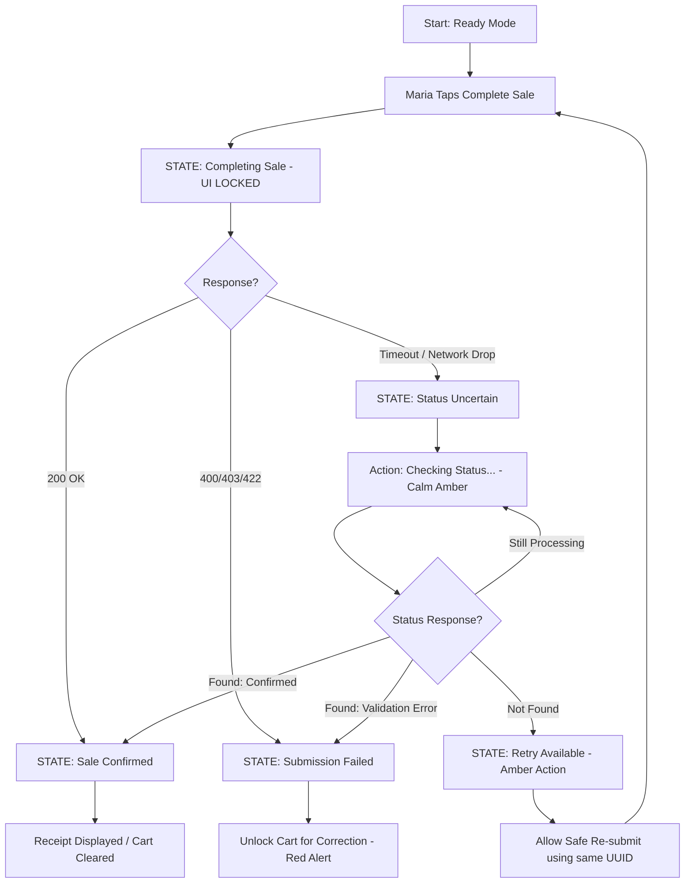
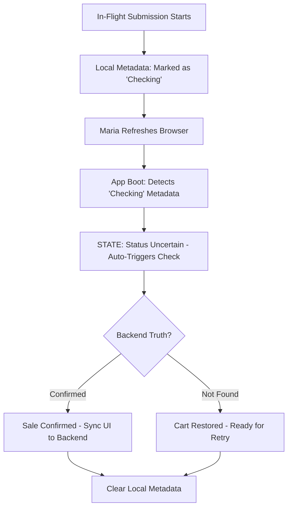

# UX Design Specification IPOS

**Author:** Teamsolo
**Date:** 2026-05-10

---

## Executive Summary

### Project Vision

IPOS is a premium, reconciliation-first SaaS POS platform designed for the Philippine SMB market. It bridges the gap between high-velocity retail operations and high-integrity accounting (QuickBooks) by ensuring that every transactional cent is tracked from the moment of sale to the final bank settlement.

### Target Users

- **The High-Velocity Cashier (Maria)**: Focuses on speed and "unbreakable" transactional flow.
- **The Data-Driven Owner**: Focuses on the "Operational Pulse" and business health.
- **The Accuracy-First Accountant**: Focuses on sync integrity and reconciliation exceptions.

---

## Core User Experience

### 2.1 Defining Experience: The "Final Tap" Closure

The defining interaction of IPOS is the **"Final Tap" Closure**. This is the one-second transition where the system moves from a local draft cart to a **backend-confirmed completed sale**. For Maria, this moment must provide absolute closure: the UI must be unmistakable about whether the sale is "Completing," "Confirmed," or "Failed," ensuring she never has to guess if a customer's transaction was successfully recorded.

### 2.2 User Mental Model

- **The "Done" Expectation**: Maria’s mental model is physical—once the receipt is ready, the transaction is over. The digital system must match this speed without skipping the "truth checkpoint" of backend confirmation.
- **The "Safety Net" Model**: Users currently fear browser interruptions. Our model replaces this with the **Zero-Loss Recovery** promise: "My work is protected locally until the backend takes ownership; if the submission fails, my work is instantly restored for retry."

### 2.3 Success Criteria

- **Transactional Velocity**: Visual feedback for the "Final Tap" must occur in <100ms. Full backend confirmation should complete in <2s under normal network conditions.
- **Information Honesty**: The UI must never show a "Confirmed" state before the backend has committed the transaction record.
- **Recovery Success**: Maria can recover the draft cart and payment entries in defined, tested scenarios such as browser refresh, short network interruption, and failed submission.

---

## Desired Emotional Response

### Primary Emotional Goals by Role

- **Maria / Cashier: Protected Flow**: *“The system has my back.”*
- **Branch Manager: Operational Confidence**: *“I can close the branch with certainty.”*
- **Owner: Informed Pulse**: *“I know what happened today.”*
- **Accountant: Reconciliation Confidence**: *“I only need to fix exceptions.”*

---

## UX Pattern Analysis & Inspiration

### Inspiring Products Analysis

- **Square POS**: Side-Drawer Cart and High-Density Catalog Grid.
- **GCash / Maya**: Familiar Reference Number Entry patterns.
- **Linear**: Exception-First Dashboard for Accountants.

---

## Visual Design Foundation

### 3.1 The IPOS State Mapping System

#### 1. Cashier Transaction States (Maria's World)

| State | Label | Icon | Color Semantic | Meaning | Primary Action |
| :--- | :--- | :--- | :--- | :--- | :--- |
| **Draft** | Draft Cart | `ShoppingBag` | **Slate** | Local work-in-progress | Add Item / Pay |
| **Ready** | Ready to Complete | `Zap` | **Indigo** | Validated & ready | Complete Sale |
| **In-Flight** | Completing Sale... | `Loader2` (Spin) | **Blue** | Submission in progress | None (Locked) |
| **Uncertain** | Status Uncertain | `Search` | **Amber** | Timeout occurred | Check Status |
| **Success** | Sale Confirmed | `CheckCircle2` | **Emerald** | Backend confirmed | Print / Next Sale |
| **Failed** | Submission Failed | `XCircle` | **Red** | Backend rejected | View Error |
| **Retry** | Retry Available | `RefreshCw` | **Amber** | Safe to resubmit | Resubmit |
| **Restored** | Cart Restored | `History` | **Blue** | Session auto-recovered | Continue |

---

## Design Direction Decision: The IPOS Hybrid System

### 4.1 Chosen Hybrid Direction

IPOS adopts a **Role-Specific Hybrid Direction**:
- **POS**: A dual-mode entry system (Grid vs. List) sharing a unified Transaction Hub.
- **Accountant**: An exception-first Data Hub.
- **Owner**: A summary-first Operational Pulse.
- **Failure**: The "Failure Guardian" is the core state machine for all roles.

---

## User Journey Flows

### 5.1 Maria’s Resilient Checkout Flow

### 5.2 Safe Recovery: Refresh During In-Flight

---

## Component Strategy

### 6.1 Component Integrity Standards

IPOS components are not merely UI elements; they are active guardians of the financial transaction truth. Every primary component must support the **Single-Action Guard** and **Truth-Link** (idempotency) rules.

### 6.2 MVP Component Set (The "Unbreakable" UI)

| Component | Purpose | Integrity Rule |
| :--- | :--- | :--- |
| **IPOSButton** | Final Tap checkout action | **Single-Shot Guard**: Disables instantly on tap. |
| **TransactionStore** | Local truth brain | **Immediate Persistence**: Stores draft/in-flight metadata before API call. |
| **StatusUncertainPanel** | Timeout/Refresh guard | **Wait-for-Truth Trap**: Blocks UI until server status is resolved. |
| **FailureGuardianBanner** | Recovery messaging | **State Sync**: Only exposes Retry after safety confirmation. |
| **Reference Guard** | Payment ref capture | **Validation-First**: Disables checkout until ref # is provided. |
| **Split-Pay Wizard** | Multi-method allocation | **Precision Lock**: Disables checkout until balance is zero. |
| **Sticky Cart** | Persistent Draft | **Integrity Lock**: Locked during submission; cleared only on 200 OK. |
| **Receipt Panel** | Final Closure | **Backend-Only**: Renders only after server-side confirmation. |

---

## UX Consistency Patterns

### 7.1 The Tri-Signal Feedback Pattern

Every status change in IPOS must use the **Tri-Signal Rule**:
- **Color**: Semantic meaning (Emerald, Red, Amber, Slate).
- **Icon**: Distinct glyphs (Check, XCircle, Alert, ShoppingBag).
- **Label**: Explicit, human-readable text (e.g., "Sale Confirmed").

### 7.2 Destructive Action Levels

| Level | Risk Type | Examples | UI Pattern | Audit |
| :--- | :--- | :--- | :--- | :--- |
| **L1** | **Draft Edit** | Remove Item, Change Qty | Simple Tap / Undo | None |
| **L2** | **Cart Clear** | Clear Full Draft, Cancel | Confirmation Dialog | None |
| **L3** | **Void Sale** | Reversing Confirmed Sale | Manager Pin + Reason | **Full Audit** |
| **L4** | **Refund** | Returning Funds | Manager Pin + Reason + Method | **Full Audit** |

**Rule**: Never use the word "Void" for Draft Cart actions. Use "Remove" or "Clear."

### 7.3 Consistency Principle

> Draft actions protect workflow. Confirmed-sale actions protect financial integrity.

---

## Responsive Design & Accessibility

### 8.1 Device Prioritization (The 1-2-3 Rule)
1. **Tablet Landscape (Primary POS)**: Mission-critical for Maria. 2/3 Catalog + 1/3 Sticky Cart.
2. **Desktop/Laptop (Operational Center)**: High-density workspace for Accountant, Manager, and Owner.
3. **Mobile Phone (Owner Pulse)**: Read-only summary monitoring. **Not an MVP checkout target.**

### 8.2 Mobile Owner Pulse (Read-Only Summary)
- **Goal**: Answers "What happened today, and what needs attention?"
- **Content**: Gross/Net Sales, Payment Mix, Branch Comparison, Exception Counts, Void/Refund Alerts.

### 8.3 Role-Aware Accessibility (ARIA Hierarchy)
- **Cashier (Maria)**: Announce Sale Confirmed, Submission Failed, Status Uncertain, Connection Interrupted. **Silence all accounting background noise.**
- **Accountant**: Announce Sync Failed, Fix Required, Mapping Missing, Reconciliation Mismatch.
- **Owner**: Announce Major Exception Spikes and Business Alerts.

### 8.4 Responsive Principle
> Accessibility must follow the same role-specific information hierarchy as the visual UI.
