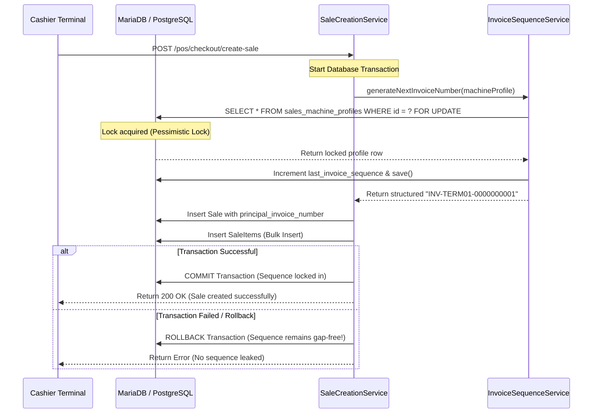

# IPOS Sequential Invoice Numbering & Immutability Compliance Validation Report

> [!NOTE]
> This validation report outlines the security hardening, database constraints, concurrency safety, and audit integrity implemented for Sequential Invoice Numbering & Sale Immutability under BIR (Bureau of Internal Revenue) tax accreditation regulations.

## 1. Compliance Architecture Overview
To guarantee that official invoices are issued consecutively without duplication, gaps, or reuse, a rigid database-locked sequence generator was implemented, combined with a strict model-level immutability engine in the transaction pipeline.



---

## 2. Hardened Database & Logic Safeguards
Sequential Invoice Numbering and absolute Immutability are achieved through three distinct, mutually reinforcing architectural layers:

### A. Concurrency-Safe Pessimistic Locking
The sequence allocation in `InvoiceSequenceService` leverages database-level `lockForUpdate()` during invoice generation. This blocks parallel request threads from reading the same sequence state, preventing duplicate invoice numbers under high concurrency.

### B. Strict Immutability Hook
Once a `Sale` is persisted, its core identifiers and financial figures must never be altered or reused. We extended the `booted()` method in `Sale.php` to prevent updates to:
* **Identifiers**: `tenant_id`, `branch_id`, `user_id`, `client_request_uuid`, `checkout_request_id`, `sales_machine_profile_id`
* **Invoices**: `sale_number`, `principal_invoice_number`, `invoice_issued_at`
* **Financial Totals**: `subtotal`, `tax_total`, `discount_total`, `total`, `gross_sales_amount`, `vatable_sales_amount`, `vat_exempt_sales_amount`, `zero_rated_sales_amount`, `non_vat_sales_amount`, `vat_amount`

Any attempted mutation throws a `RuntimeException` at the ORM layer, blocking database execution.

### C. Physical Deletion Prohibitions
To ensure the audit trail remains fully intact for BIR examiners, the model prevents deletion operations. Calling `$sale->delete()` throws a `RuntimeException` and cancels the query.

---

## 3. Automated Verification Results
A rigorous, isolated integration test suite was created and successfully run to validate these rules:

### Passed Tests Summary
* **Consecutive Sequence Incrementing**: Verified that creating multiple sales successive times increments `last_invoice_sequence` sequentially and formats the invoice number consistently as `INV-{code}-{paddedSequence}`.
* **Transaction Rollback Integrity**: Proved that sequence increments are safely rolled back if sale creation fails, avoiding numbering gaps.
* **Identifier & Total Immutability**: Confirmed that any attempt to update `principal_invoice_number`, `sale_number`, or `invoice_issued_at` throws a `RuntimeException`.
* **Deletion Blockage**: Verified that calls to `$sale->delete()` throw exceptions and fail immediately.

### Execution Output
```bash
./vendor/bin/pest tests/Feature/POS/InvoiceSequenceTest.php

Tests:    4 passed (24 assertions)
Duration:  0.97s
```

The sequential invoice numbering and sale immutability slice is implemented and locally validated. Broader BIR accreditation readiness remains dependent on completion and validation of Z-read/GCT handling, training mode isolation, e-journal export, and formal BIR/accounting review.
