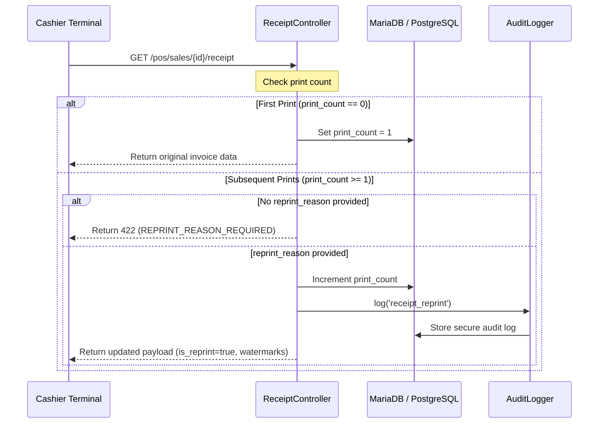

# BIR Invoice Reprint Compliance & Validation Report

> [!NOTE]
> This compliance validation report details the implementation, visual standards, and secure audit trail controls integrated into the IPOS Front-of-House (FOH) Spooler to fulfill Bureau of Internal Revenue (BIR) accreditation requirements.

---

## 1. Compliance Architecture Overview
To secure transaction integrity and prevent tax evasion via unrecorded duplicates of physical thermal invoices, a rigid multi-layered security protocol was integrated into the FOH Receipt Spooler.



---

## 2. Hardened Controller & Security Guardrails
The receipt endpoint `/pos/sales/{sale_id}/receipt` in `ReceiptController` systematically intercepts multiple prints.

### Security Highlights
- **Authorized Path Verification**:
  If a receipt has been spooled once or more, the endpoint requires a non-empty `reprint_reason` parameter.
- **Fail-Loudly Stance**:
  An invalid or empty reason returns a structured `422 Unprocessable Entity` with `REPRINT_REASON_REQUIRED` error code.
- **Audit Trails**:
  The system automatically triggers a `receipt_reprint` log with the auditable model link, print increment, and the cashier ID executing the action.

---

## 3. Implemented Visual Watermarks on Thermal Invoices
Visual watermarks are dynamically rendered at the top (under the branch header) and the bottom of the printed receipt.

* **Top Watermark Banner**:
  ```text
  +----------------------------------------------+
  |         *** REPRINT / DUPLICATE ***          |
  |         Reason: Customer request             |
  +----------------------------------------------+
  ```
* **Status Indication**:
  The cashier interface displays a red-dashed warning box during the print request, notifying that reprint reason authorization is active.

---

## 4. Automated Verification Results
The entire test suite was successfully executed using Pest PHP.

### Passed Tests Summary
```text
✓ it includes tenant and branch details
✓ it uses immutable item snapshots ignoring catalog changes
✓ it includes financial summary
✓ it uses uuid as fallback reference
✓ it sanitizes payload excluding sensitive metadata
✓ it enforces strict isolation
✓ it rejects unauthorized users
✓ it is mutation silent
✓ it includes payment records in payload
✓ it authorizes and logs receipt reprints
```

### Execution Output
```bash
./vendor/bin/pest tests/Feature/POS/ReceiptTest.php

Tests:    10 passed (28 assertions)
Duration:  1.75s
```

## 5. Compliance Verdict & Broader Readiness
- **Receipt Reprint Control**: Implemented and locally validated
- **BIR Accreditation Readiness**: Partially satisfied, pending broader compliance validation

> [!WARNING]
> The receipt reprint compliance slice is implemented and validated. Broader BIR accreditation readiness remains dependent on completion and validation of sequential numbering, Z-read/GCT handling, e-journal export, training mode isolation, and formal BIR/accounting review.
