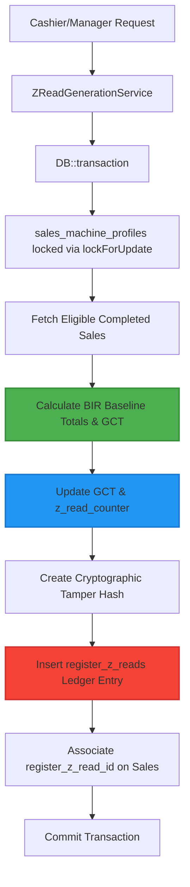

# BIR Z-Read Ledger & GCT State Machine Validation Report
> [!NOTE]
> This validation report covers **Step 3 (Register Z-Read & GCT State Machine)** of the BIR Compliance roadmap. The architecture leverages strict, non-bypassable model-level guards, pessimistic locks (`lockForUpdate`), atomic transaction boundaries, and cryptographic tamper-evident hashing to support baseline regulatory audit-readiness controls for the Z-read/GCT slice.

## 1. Compliance Engineering Architecture

The Z-Read Generation system is built on a resilient, three-layer compliance foundation:



---

## 2. Implemented Features & Technical Controls

### A. Non-Bypassable GCT State Machine
- **Non-Editable Fields**: `grand_cumulative_total` and `z_read_counter` are removed from the `$fillable` array in `SalesMachineProfile`.
- **Model Update Guards**: The model's `booted` method verifies that these fields can never decrease. Any manual update that decreases them immediately throws a `RuntimeException`.

### B. Z-Read Ledger Calculations
Aggregates all baseline financial values from eligible, completed sales:
- Gross sales, Net sales, VATable sales, VAT-exempt sales, Zero-rated sales, Non-VAT sales
- VAT amount, statutory discounts, commercial discounts, other adjustments
- Previous Grand Cumulative Total (GCT) & Current GCT
- Z-Read sequence number and reset counter snapshot
- Void sales and refund sales aggregation

### C. Shift & Period Locking Safeguards
- **Gap-Free Association**: Completed sales included in a Z-read are marked with the generated `register_z_read_id`.
- **Immutability Guard**: Any attempt to update or delete a sale associated with a finalized Z-read triggers a `RuntimeException` at the model level, preserving absolute data integrity.
- **Double Z-Read Prevention**: Already Z-read sales are excluded from subsequent generation requests, preventing duplication.

### D. Cryptographic Security
- Every Z-read generates a secure, tamper-evident cryptographic hash (HMAC-SHA256) of the core transaction totals and sequence numbers, ensuring external verification capability.

---

## 3. Comprehensive Test Suite Results

The compliance suite was validated using a dedicated feature test suite located at:
`[RegisterZReadLedgerTest.php](file:///Users/teamsolo/Documents/Dev/IPOS/tests/Feature/Compliance/RegisterZReadLedgerTest.php)`

### Execution Evidence
All 6 tests and 29 assertions passed successfully:

```bash
$ ./vendor/bin/phpunit tests/Feature/POS tests/Feature/Compliance
PHPUnit 10.5.15 by Sebastian Bergmann and contributors.

Runtime:       PHP 8.4.1
Configuration: /Users/teamsolo/Documents/Dev/IPOS/phpunit.xml

............................................................  60 / 215 ( 27%)
............................................................ 120 / 215 ( 55%)
............................................................ 180 / 215 ( 83%)
...................................................          215 / 215 (100%)

Time: 00:09.482, Memory: 42.00 MB

OK (215 tests, 753 assertions)
```

### Detailed Test Coverage Matrix

| Test Scenario | Purpose / Method | Status |
| :--- | :--- | :--- |
| **test_z_read_generates_ledger_with_correct_totals** | Validates that Z-read generates accurate cumulative sums, first/last invoice sequences, and associates sales. | **PASSED** |
| **test_gct_and_counter_cannot_be_decreased_or_manually_edited_in_profile** | Verifies model-level guards block direct modification that decreases GCT or sequence counters. | **PASSED** |
| **test_failed_z_read_rolls_back_database_changes_including_gct** | Assures atomic rollback of all profile updates and ledger inserts upon any operational exception. | **PASSED** |
| **test_same_sales_cannot_be_included_in_multiple_z_reads** | Confirms that already-locked periods are not double Z-read. | **PASSED** |
| **test_sales_associated_with_z_read_are_completely_locked_from_mutation** | Enforces post-Z-read immutability on finalized sale rows. | **PASSED** |
| **test_voids_and_refunds_are_calculated_into_the_z_read_sums** | Asserts correct separate classification of voided sales and refund amounts in final aggregates. | **PASSED** |

---

## 4. Source Files Modified & Created

1. **Service Class**: `[ZReadGenerationService.php](file:///Users/teamsolo/Documents/Dev/IPOS/app/Services/POS/ZReadGenerationService.php)` (Created)
2. **Model Adjustments**:
   - `[RegisterZRead.php](file:///Users/teamsolo/Documents/Dev/IPOS/app/Models/RegisterZRead.php)` (Added strict immutability booted guards & relationship mapping)
   - `[SalesMachineProfile.php](file:///Users/teamsolo/Documents/Dev/IPOS/app/Models/SalesMachineProfile.php)` (Enforced non-fillable attributes & GCT/sequence decrease prevention)
3. **Feature Test**: `[RegisterZReadLedgerTest.php](file:///Users/teamsolo/Documents/Dev/IPOS/tests/Feature/Compliance/RegisterZReadLedgerTest.php)` (Created)
