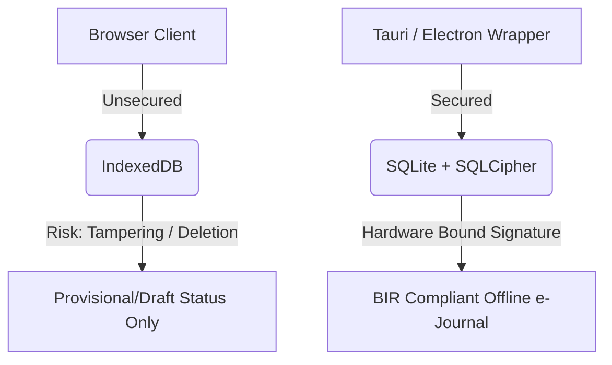

# Epic 28 Phase 2 — Controlled Offline Sales Compliance Research

This research report analyzes industry standards, best practices, and POS provider implementations (UTAK, Mosaic, iRipple, and ANSI) to establish a compliant, secure, and robust architecture for **Controlled Offline Sales (Phase 2)** under Philippine BIR (Bureau of Internal Revenue) regulations.

---

## Evidence Classification Note

This report combines public vendor statements, observable market patterns, and architecture inference. Public sources confirm that some providers advertise offline mode and synchronization, but detailed internal mechanisms such as exact local database engines, invoice prefix implementation, reconciliation workflows, and BIR-approved offline storage controls are not fully verifiable from public documentation.

Therefore, competitor-specific implementation details should be treated as benchmark assumptions unless validated through official vendor manuals, screenshots, direct vendor confirmation, or CPA/BIR accreditation review.

---

## 1. Executive Summary

Implementing controlled offline selling under Philippine tax regulations requires resolving three core challenges:
1. **Sequential Invoice Integrity**: Ensuring zero gaps or overlaps in receipt numbers without real-time server contact.
2. **Tamper-Free Storage**: Protecting local logs and e-journal data from unauthorized client-side modifications.
3. **Reconciliation & Auditing**: Properly handling late-synchronized transactions that cross calendar/fiscal days.

Publicly observable POS/offline patterns suggest that terminal-scoped numbering and native/device-bound local storage are safer design directions for controlled offline sales. However, exact vendor implementations must be treated as unverified unless supported by official manuals, vendor confirmation, or accreditation documentation.

---

## 2. Competitive Analysis: POS Provider Implementations

The table below outlines the benchmark assumptions and research hypotheses of how leading accredited POS providers in the Philippines address offline sales and compliance based on public marketing and architectural inference:

| Provider | Offline Mode Strategy | Invoicing / Sequence (Hypothesis) | Local Storage Trust Model (Hypothesis) | Sync / Reconciliation (Hypothesis) |
| :--- | :--- | :--- | :--- | :--- |
| **UTAK POS** | Tablet-native standalone mode with background auto-sync. | **Terminal-Bound Sequence**: Each tablet is bound to a specific Machine Identification Number (MIN) with a unique prefix (e.g., `UTAK-M01-`). | **Android Sandbox + SQLite**: Uses the Android OS filesystem sandbox. Prevents users from accessing database files directly without root privileges. | Automatic background sync when connectivity is restored; updates cloud back office. |
| **Mosaic POS** | Standalone "Serving Line" state for network dropouts. | **Terminal-Scoped Sequence**: Local counter incremented on the terminal, mapped during reconciliation. | **Native App Sandbox**: Relies on native client architecture and local database storage (SQLite). | Auto-syncs or permits manual upload triggers through a Serving Line Utility Menu. |
| **iRipple (Barter POS)** | Offline standalone runtime with local relational DB. | **Terminal-Bound Suffix/Prefix**: Unique, continuous sequence per physical terminal to prevent duplicates. | **OS-Bound Database**: Stores transactions in native relational databases (MS SQL Server Compact / SQLite) protected by Windows filesystem permissions. | Automatic synchronization of sales, pricing, and tax updates upon reconnection. |
| **ANSI POS** | "Standalone Mode" (e.g., WinVQP POS system). | **Terminal-Specific Serial**: Sequential numbers bound to the local machine profile. | **Windows Native Service**: Runs as a desktop client communicating with a secure local database engine. | Standalone data is reconciled and imported directly into central ERP systems (e.g., SAP). |

---

## 3. Key Compliance & Architectural Patterns

### A. Invoice Sequence Control: Terminal-Bound Prefixes
*   **The Problem with Pre-Allocated Blocks**: Reserving a range of numbers (e.g., `10001-10100`) to a terminal risks creating permanent e-journal sequence gaps if the terminal cache is cleared, corrupted, or reinitialized.
*   **The Benchmarked Design Direction**: Use **Terminal-Bound Prefixes**. Each terminal profile is registered with the BIR under a specific prefix (e.g., `INV-T01-000001`, `INV-T02-000001`). 
*   **Compliance Alignment**: The BIR evaluates sequential integrity *per register/machine*. A terminal-scoped sequence ensures that each terminal's numbering remains unbroken, non-overlapping, and fully independent. Gaps are prevented, and no online block negotiation is required.

### B. Local Storage Trust Model: Native Wrapper & Encryption
*   **IndexedDB Limitations**: Standard browser storage (IndexedDB/LocalStorage) is vulnerable to tampering via browser developer tools. It can also be wiped out by clearing browser cache.
*   **The Benchmarked Design Direction**:
    *   **Provisional Queue Only**: If running in a standard web browser, IndexedDB must strictly act as a provisional/temporary draft queue. Transactions are not treated as "Official Receipts" until they reach the server database.
    *   **Encrypted Native Client**: For true offline selling, wrap the web client inside a native desktop or mobile container (e.g., **Tauri** or **Electron**). This wrapper must store offline transactions in an encrypted local database (e.g., **SQLite with SQLCipher**) bound to the device's hardware signature (UUID/MAC address).

### C. Z-Read and Grand Cumulative Total (GCT) Handling
*   **The Sync Boundary Challenge**: A transaction occurs offline on Monday at 9:00 PM, but the terminal does not sync until Wednesday. Meanwhile, Monday and Tuesday's Z-reports have already been run.
*   **Reconciliation Protocols**:
    1.  **Original Occurrence Insertion (Compliant Auditing)**: The server accepts the transaction and retroactively inserts it into Monday's sales registry. The system regenerates or flags Monday's Z-report with a **Late-Sync Audit Log entry**.
    2.  **Prior Period Adjustments**: Alternatively, the transaction is reported in the Z-read of the *sync date* (Wednesday) but is explicitly categorized in a sub-ledger as "Prior Period/Offline Adjustments" with its original date of occurrence. This prevents modifying historically closed ledgers while keeping the overall GCT accurate.

### D. Document Presentation: Provisional Receipts
*   Receipts printed while the terminal is offline must have distinct wording to prevent audit confusion:
    *   Watermarked with `"PROVISIONAL RECEIPT - OFFLINE"` or `"SUBJECT TO RECONCILIATION"`.
    *   Contains the notice: *"This is a temporary representation. Official invoice status activates upon system synchronization."*

---

## 4. Recommendations for IPOS Phase 2

For IPOS, a hybrid terminal-bound model is recommended:

1.  **Terminal-Bound Prefixes**: Each terminal has a permanent registered prefix (e.g., `INV-T01-000001`, `INV-T02-000001`). Each terminal sequence is independent and non-overlapping.
2.  **Server-Side Registry**: The server remains the registrar of:
    - terminal prefix
    - starting sequence
    - current accepted sequence
    - suspended/lost ranges
    - reconciliation status
3.  **Independent Client Consumption**: The offline client may consume only its own terminal-bound sequence context.
4.  **Provisional Client Status**: Official invoice status remains pending until server reconciliation, unless later CPA/BIR review approves offline-issued invoices as official.
5.  **Strict Security Containment**: If the POS runs in a standard browser, enforce a policy that **IndexedDB is only a provisional checkout queue**. If the user requires official offline selling with offline printed receipts, they must deploy the IPOS desktop wrapper (Tauri) with an encrypted SQLite store.
6.  **Audit-Locked Reconciliation**: Implement a dedicated `ReconciliationService` on the Laravel backend. It must validate the client signature, check for duplicate client UUIDs, recalculate taxes using fixed-point decimals, and write the late-sync audit logs.
7.  **Fiscal-Day Alignment**: Record the transaction under its actual local timestamp, but apply a "Late-Sync Adjustment" status to ensure Z-report integrity and GCT verification.

---

## 5. Recommended Architectural Conclusion

For IPOS, Phase 2 Controlled Offline Sales should not proceed as browser-only IndexedDB official selling.

The recommended future design is a terminal-bound, server-registered offline model:
- each sales machine profile has a unique registered sequence prefix
- offline transactions are device-bound and signed
- browser-only IndexedDB remains provisional
- official offline selling requires native/encrypted local storage review
- all synced transactions are recalculated server-side
- late-sync records require audit classification
- GCT/Z-read remain server-authoritative unless formally approved otherwise

---

## 6. Project Governance Status

**Epic 28 Phase 2 — Controlled Offline Sales**

*   **Status**: Approved for Production-Grade Development — External Review Deferred Until Post-Development
*   **Release Classification**: Early Partner Pilot / Review Required
*   **External Review**: Deferred until after application development
*   **Marketing**: Not allowed
*   **Compliance Claim**: Not final-reviewed

> [!NOTE]
> Epic 28 Phase 2 is approved for production-grade development for controlled early partner adoption. External CPA/BIR review is deferred until post-development. Marketing or formal compliance claims remain prohibited until review is completed.

