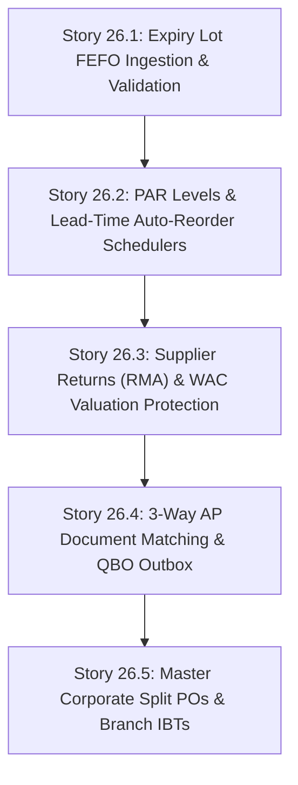

# Implementation Plan: Epic 26 — Advanced Supply Chain, Expiry Tracking & Automated Procurement

**Status: PLANNED / DEFERRED**

## 1. Epic Overview
Epic 26 expands the core inbound logistics foundation delivered in Epic 20 to provide enterprise-grade supply chain capabilities. By natively integrating expiry lot management, automated reordering thresholds, supplier returns, 3-way invoice matching, and tenant-wide split purchase orders, IPOS secures a major competitive advantage over standard cloud POS systems (like Toast and UTAK) while offering a modern, cloud-first alternative to heavy, expensive ERP systems (like SAP/ANSI).

### Key Business Goals:
1.  **Zero Perishable Waste**: Enable grocery, pharmacy, and fresh-F&B merchants to track batches, enforce FEFO (First-Expired, First-Out) depletion, and receive automated near-expiry alerts.
2.  **Procurement Automation**: Maintain optimal inventory levels automatically, preventing out-of-stock scenarios without locking up excess capital.
3.  **Financial Immutability & Trust**: Prevent invoice fraud and billing errors through automated 3-way document matching integrated directly into our QuickBooks outbox.
4.  **Logistical Efficiency**: Allow corporate-level purchasing officers to raise aggregated orders that seamlessly split and distribute across multi-branch networks.

---

## 2. Execution Boundaries & Guardrails
To prevent data contamination and preserve system integrity, the implementation of Epic 26 must adhere strictly to these architectural boundaries:

1.  **Multi-Tenant Fail-Closed Isolation**: All automated reorder schedulers and multi-branch PO splitters must boot under the validated `TenantContext`. Cross-tenant queries are strictly prohibited and will trigger immediate runtime exceptions.
2.  **State Immutability**: Posted Goods Receiving Vouchers (GRVs), posted Supplier Returns (RMAs), and approved 3-way matches are **strictly read-only** and historically immutable. Adjustments must be made through offsetting transactions, never by mutating historical records.
3.  **Weighted Average Cost (WAC) Protection**: Any reverse logistics (Supplier Returns) must recalculate the corresponding branch's WAC using high-precision `bcmath` operations to 4 decimal places.
4.  **No Direct Financial Ledgering**: IPOS does not store double-entry cash books. AP liabilities are calculated inside IPOS to run the 3-Way Match and then immediately pushed to the QuickBooks Accounting Outbox (Epic 8) for payment execution.

---

## 3. Database Schema Extensions

### A. Expiry & Batch Track Tracking
Extend the `products` table:
*   `expiry_tracking_enabled`: boolean (default `false`) - Enforces lot/expiry capture on POS checkout and receiving.

### B. PAR & Automated Reordering
Extend the `branch_inventories` table:
*   `reorder_level`: decimal(12,4), nullable - The threshold under which a PO recommendation is triggered.
*   `max_level`: decimal(12,4), nullable - The Target PAR stock level for automated replenishments.
*   `lead_time_days`: integer (default `0`) - Vendor fulfillment delay.

### C. Supplier Returns & RMAs
Create the `supplier_returns` table:
*   `id`: bigInteger, primary key
*   `tenant_id`: bigInteger, foreign key (fails closed)
*   `branch_id`: bigInteger, foreign key
*   `supplier_id`: bigInteger, foreign key
*   `receiving_id`: bigInteger, foreign key, nullable (linked receiving voucher)
*   `status`: string (`draft`, `pending_approval`, `posted`, `cancelled`)
*   `return_date`: timestamp
*   `document_number`: string (unique per tenant)
*   `total_amount`: decimal(19,4)
*   `created_by`: bigInteger, foreign key

Create the `supplier_return_lines` table:
*   `id`: bigInteger, primary key
*   `supplier_return_id`: bigInteger, foreign key
*   `product_id`: bigInteger, foreign key
*   `quantity`: decimal(12,4)
*   `unit_cost`: decimal(19,4)
*   `batch_number`: string, nullable
*   `expiry_date`: date, nullable

### D. Accounts Payable & 3-Way Matching
Create the `supplier_invoices` table to track vendor bills against POs and Receipts:
*   `id`: bigInteger, primary key
*   `tenant_id`: bigInteger, foreign key
*   `supplier_id`: bigInteger, foreign key
*   `invoice_number`: string (unique per vendor/tenant)
*   `invoice_date`: date
*   `due_date`: date
*   `amount_excluding_tax`: decimal(19,4)
*   `tax_amount`: decimal(19,4)
*   `total_amount`: decimal(19,4)
*   `matching_status`: string (`pending`, `matched`, `variance_discrepancy`, `disputed`)
*   `matching_metadata`: json (records details of the 3-way match)

---

## 4. User Story Breakdown

### Story 26.1 — Expiry Lot FEFO Ingestion & Validation
*   **Goal**: Prevent the sale of expired inventory and automate product stock rotation.
*   **Deliverables**:
    *   Add `expiry_tracking_enabled` to `products`.
    *   Enforce lot selection on POS checkout and Goods Receiving for marked items.
    *   Implement **FEFO (First-Expired, First-Out)** stock deduction logic.
    *   Build a "Near Expiration Alert Register" inside the Pulse Dashboard, highlighting batches expiring within 7/30/60 days.

### Story 26.2 — PAR Levels & Lead-Time Auto-Reorder Schedulers
*   **Goal**: Automatically maintain target inventory thresholds without manual calculations.
*   **Deliverables**:
    *   Add reorder configuration parameters to `branch_inventories`.
    *   Create a daily scheduler job (`ipos:replenish-inventory`) that scans stock levels against `reorder_level` within each active Tenant.
    *   Compile automated draft Purchase Orders aggregated by supplier and branch, pre-filled to reach `max_level` (PAR), factoring in vendor lead times.

### Story 26.3 — Supplier Returns (RMA) & WAC Valuation Protection
*   **Goal**: Support reverse logistics for damaged or incorrect goods with absolute costing integrity.
*   **Deliverables**:
    *   Create the `supplier_returns` and `supplier_return_lines` schema.
    *   Implement dynamic **WAC recalculation** upon return posting (subtracting returned quantities at their received unit cost and recalculating remaining branch average cost using high-precision `bcmath` operations).
    *   Generate printable PDF Supplier Return/Debit Notes with distinct transaction tracking numbers.

### Story 26.4 — 3-Way AP Document Matching & QBO Outbox
*   **Goal**: Establish absolute trust in procurement disbursements and prevent billing overpayments.
*   **Deliverables**:
    *   Create the `supplier_invoices` schema.
    *   Implement the **3-Way Matching engine**: Automate comparison of `purchase_orders.unit_cost/qty`, `supplier_receivings.qty_received`, and `supplier_invoices.total_amount`.
    *   Flag any variance discrepancies exceeding 0.01% for manual review.
    *   Upon successful match, serialize the verified AP liability payload and push it to the `AccountingOutbox` for seamless QuickBooks import.

### Story 26.5 — Master Corporate Split POs & Branch IBTs
*   **Goal**: Streamline procurement workflows for multi-branch retail networks.
*   **Deliverables**:
    *   Create a Tenant-wide "Master PO" workspace allowing corporate buyers to specify quantities distributed across multiple physical branch addresses.
    *   Upon posting, atomically split the master PO into branch-specific child POs under strict branch-isolation scopes.
    *   Provide an integrated **Inter-Branch Stock Transfer (IBT)** workbook, enabling rapid stock transfers between nearby stores with automatic receiving validation.

---

## 5. Security, Audit, and Logging Requirements
*   **RBAC Enforcement**:
    *   Only `Tenant Owner` and `Procurement Manager` roles can create Master POs, approve 3-Way Matches, and post Supplier Returns.
    *   `Cashiers` are strictly locked out of all Epic 26 actions.
*   **Audit Logging**:
    *   Every batch creation, expiry override, posted return, and matched invoice must append a secure, immutable record in `audit_logs` capturing the authenticated `user_id`, `tenant_id`, `branch_id`, transaction payload, and client IP address.
