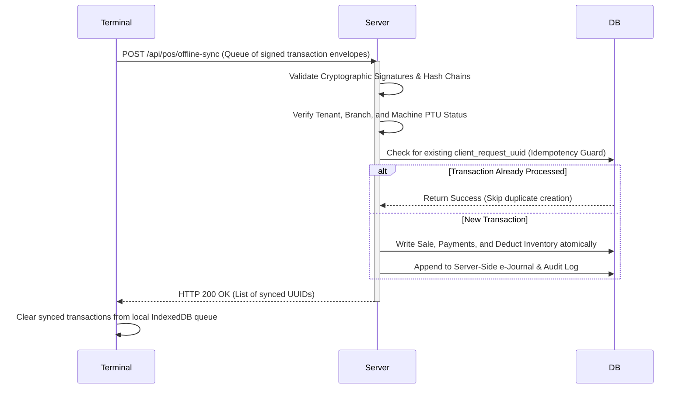

# Epic 28 Phase 2: Controlled Offline Sales Design Brief

This design brief establishes the architectural specifications, synchronization protocols, and compliance guardrails for **Controlled Offline Sales** in the IPOS POS terminal.

> [!WARNING]
> **DEVELOPMENT APPROVED — POST-DEVELOPMENT REVIEW REQUIRED**
> Epic 28 Phase 2 is approved for production-grade development for controlled early partner adoption. External CPA/BIR review is deferred until post-development. Marketing or formal compliance claims remain prohibited until review is completed.

---

## 1. Hybrid Terminal-Bound Sequence Design

To guarantee sequential invoice integrity when offline without cross-terminal duplicates, the system must utilize a hybrid terminal-bound sequence model.

### 1.1 Model Specifications
1. **Registered Prefix**: Each terminal has a permanent registered prefix in the system (e.g., `INV-T01-000001`, `INV-T02-000001`).
2. **Independent Sequences**: Each terminal's numbering sequence is independent and non-overlapping.
3. **Server Registry**: The server remains the registrar of terminal prefixes, starting sequences, current accepted sequences, suspended/lost ranges, and reconciliation status.
4. **Client Consumption**: The offline client may consume only its own terminal-bound sequence context.
5. **Provisional Client Status**: Official invoice status remains pending until server reconciliation, unless later CPA/BIR review approves offline-issued invoices as official.


---

## 2. Device/Terminal Identity Binding Design

Each physical terminal must be bound to a unique, verified configuration to ensure accountability and trace back.

### 2.1 Hardware and App Fingerprinting
1. **Machine Registration**:
   - In compliance with BIR eAccReg requirements, each POS terminal must have a distinct Permit to Use (PTU) and Machine Identification Number (MIN).
   - The device configuration context must be verified online before caching is activated.
2. **Session Context Security**:
   - The combination of `tenant_id`, `branch_id`, and `machine_profile_id` must be stored securely in IndexedDB.
   - To prevent identity spoofing, offline transactions must be signed using a cryptographic client signature key derived during the initial online handshake.

### 2.2 PTU/MIN Freshness Window
Offline checkout must be blocked if cached terminal registration data is stale.

Required cached fields:
- PTU number
- MIN
- serial number
- TIN/VAT or Non-VAT registration details
- branch identity
- sales machine profile identity
- last successful configuration sync timestamp

Initial rule:
If the terminal has not synced registration/profile data within 72 hours, official offline checkout is blocked until online revalidation.

---

## 3. Revoked/Lost Invoice Range Recovery Design

If a terminal fails, is reinstalled, or loses data while containing unsynced offline transactions, we must recover the allocated range cleanly without breaking sequential numbering continuity.

### 3.1 Voiding and Reclamation Protocols
1. **Unsynced Sequence Gap Recovery**:
   - If a terminal is reinitialized online, the server checks for outstanding pre-allocated ranges that were never uploaded.
   - The server marks the outstanding range as `SUSPENDED` or `LOST/VOIDED` in the database to prevent future reuse.
2. **E-Journal Gap Audits**:
   - The e-journal exporter must generate clear, machine-readable audits explaining any missing numbers in the sequence (e.g., *"Invoice numbers 10045-10100 voided due to terminal local storage corruption"*), complete with supervisor authorization logs.

---

## 4. Local Append-Only Journal Design

To maintain record integrity, the terminal must write transaction records to an append-only, cryptographically verifiable local offline journal.

> [!CAUTION]
> **Storage Security Warning**: For browser-only deployments, IndexedDB may be used only as a provisional offline queue and diagnostic journal. It must not be represented as tamper-free official storage. If Phase 2 proceeds to official offline sales, the storage model must be reviewed for device-bound controls, encryption, signature protection, and BIR/accounting acceptance. For stronger assurance, a native wrapper or local encrypted database such as SQLCipher should be evaluated.

### 4.1 Immutability Guardrails
1. **Chained Cryptographic Hashes**:
   - Each offline transaction must include a SHA-256 hash of its contents combined with the hash of the *previous* transaction in the log (similar to a local blockchain structure).
   - Example record envelope:
     ```json
     {
       "sequence_id": 10042,
       "payload": { "total": "250.00", "vat_amount": "26.79" },
       "prev_hash": "a1b2c3d4...",
       "current_hash": "e5f6g7h8..."
     }
     ```
2. **Immutable Storage**:
   - Local records can only be appended. No updates or deletions are allowed via the client runtime API.
   - Voids are handled strictly by appending a new "Void Transaction" record pointing to the original offline sequence number.

---

## 5. Sync/Reconciliation Protocol

When connection is restored, the terminal must sync the offline transaction queue to the server using an idempotent, transaction-safe reconciliation pipeline.

### 5.1 Idempotent Ingestion Lifecycle


---

## 6. Fixed-Point Decimal Parity Rules

To prevent pennies/cents discrepancies between the client's calculations and the server's database validation, both engines must calculate taxes and totals using identical arithmetic.

### 6.1 Decimal Parity Constraints
1. **Precision Rules**:
   - All arithmetic must be performed using **fixed-point decimal representation** (not IEEE 754 floating point numbers).
   - In Javascript, calculations must use `Big` or a similar custom integer-based math helper (e.g., cents representation).
2. **Rounding Logic**:
   - Rounding must conform strictly to BIR regulations (typically 2 decimal places, rounded half-up).
   - Tax-inclusive and tax-exclusive computation steps must be modeled in JavaScript exactly to mirror PHP's `TaxCalculationService`.

---

## 7. Accountant/BIR Consultant Review Checklist

Before any Phase 2 code is committed, the engineering team, CPA, and BIR consultant must check off the following compliance items:

* [ ] **Sequential Audit**: Does the system ensure that every allocated invoice block is either accounted for by a verified sale, a documented void, or a logged suspension?
* [ ] **Z-Read & GCT Integrity**: Are offline-generated sales correctly aggregated into the correct fiscal day's Z-read once synced? If a sync crosses a calendar day, are the sales accounted for on the day they actually occurred or the day they were uploaded? (Standard compliance requires the actual transaction date, meaning historical Z-reports may need to be adjusted/re-opened with audit logs).
* [ ] **E-Journal Completeness**: Does the e-journal generator contain the full text of all printed invoices, matching the local offline hashes?
* [ ] **Tamper Resistance**: Can an administrative user edit the IndexedDB database using developer tools without invalidating the cryptographic hash chain and blocking sync?
* [ ] **Non-Resettable Accumulators**: If local cumulative sales previews are required, are they clearly marked provisional, tamper-evident, and reconciled server-side before becoming official GCT/Z-read records?
* [ ] **PTU/MIN Freshness Window**: Is the 72-hour registration sync enforcement correctly modeled in the offline guard checks?
* [ ] **IndexedDB/Local Storage Trust Model & Risk Disclaimer**: Has the risk of using browser local storage for provisional queues been evaluated and approved against target compliance requirements?
