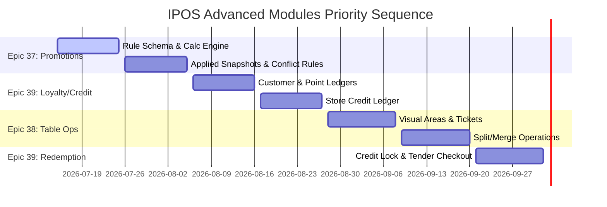

# Technical Design Specifications: Proposed Epics 37, 38, & 39

This document details the architectural guidelines, database schemas, and interface designs for the proposed advanced product epics:
1. **Epic 37: Advanced Promotions & Bundling Engine**
2. **Epic 38: F&B Table & Bill Manipulation**
3. **Epic 39: Loyalty & Store Credit Ledger**

---

## Epic 37: Advanced Promotions & Bundling Engine

### 1. Goal
Provide a flexible, rule-based promotions engine that applies discounts and combo pricing automatically during checkout (both online and offline) and calculates the cost impact of active promotions.

### 2. Architecture Boundary & Guidelines
*   **Zero Client-Side Calculation Source of Truth**: All promotions must be computed deterministically on the server during checkout. The client-side JavaScript engine is strictly a user-facing helper for offline preview.
*   **No Manual Stacking**: Unless explicitly marked as `stackable` and configured with a prioritization scheme, only one promotion (the one yielding the highest customer benefit) may apply to a given item.
*   **Version Hash Propagation**: The active promotion rules must be canonicalized and included in the `discount_rules_version_hash`. Any modification to promotion rules will flag layout/config drift on next terminal heartbeats.
*   **Audit Snapshots Required**: Applied promotions must leave a durable explanation recording the rule configuration version, the triggering items, the exact discount amount, and the calculated margins.
*   **Statutory Discount Separation**: Commercial promotions must be kept structurally separate from statutory compliance discounts (SC/PWD/Solo Parent). They must not mutate statutory calculation records or overwrite their tax-exempt bases.

### 3. Proposed Database Schema

#### `promotions` Table
```sql
CREATE TABLE promotions (
    id UUID PRIMARY KEY,
    tenant_id UUID NOT NULL,
    name VARCHAR(255) NOT NULL,
    description TEXT,
    rule_type VARCHAR(50) NOT NULL, -- 'bogo', 'discount_tier', 'combo_package'
    priority INT DEFAULT 0, -- Higher number evaluates first
    starts_at TIMESTAMP NOT NULL,
    ends_at TIMESTAMP NOT NULL,
    is_active BOOLEAN DEFAULT TRUE,
    branch_scope JSONB, -- Array of branch UUIDs allowed, or null for all branches
    created_at TIMESTAMP,
    updated_at TIMESTAMP
);
```

#### `promotion_rules` Table
```sql
CREATE TABLE promotion_rules (
    id UUID PRIMARY KEY,
    promotion_id UUID REFERENCES promotions(id) ON DELETE CASCADE,
    schema_version VARCHAR(20) NOT NULL DEFAULT 'v1',
    condition_type VARCHAR(50) NOT NULL,
    reward_type VARCHAR(50) NOT NULL,
    conditions JSONB NOT NULL,
    rewards JSONB NOT NULL,
    stackable BOOLEAN DEFAULT FALSE,
    min_spend_centavos INT DEFAULT 0,
    max_applications_per_sale INT NULL,
    max_discount_centavos BIGINT NULL,
    exclusive_group VARCHAR(100) NULL,
    created_at TIMESTAMP,
    updated_at TIMESTAMP
);
```

##### Supported `condition_type` values:
*   `buy_x_get_y`: Customer buys a specified quantity of products to qualify for a reward.
*   `minimum_spend`: Cart gross total must exceed `min_spend_centavos`.
*   `category_quantity`: Customer buys a threshold quantity from a specified category.
*   `product_quantity`: Customer buys a threshold quantity of a specific product.
*   `bundle_match`: Cart must contain a exact set of different SKU items.
*   `time_window`: Rules restricted to happy hour or promotional slots.
*   `customer_segment`: Rules targeted to specific loyalty tiers or user classes.

##### Supported `reward_type` values:
*   `percent_off`: Applies a percentage reduction on the target items.
*   `amount_off`: Deducts a flat currency amount from target items.
*   `fixed_bundle_price`: Overrides total price of all matched products to a fixed bundle amount.
*   `free_item`: Appends or adjusts a specified line item to zero unit cost.
*   `cheapest_item_free`: Evaluates matched lines and voids the unit price of the cheapest qualified item.
*   `points_multiplier`: Grants a promotional loyalty points modifier during checkout.

#### `sale_promotions` Table
```sql
CREATE TABLE sale_promotions (
    id UUID PRIMARY KEY,
    tenant_id UUID NOT NULL,
    branch_id UUID NOT NULL,
    sale_id UUID NOT NULL, -- References sales table
    promotion_id UUID NOT NULL REFERENCES promotions(id),
    promotion_rule_id UUID NOT NULL REFERENCES promotion_rules(id),
    promotion_name VARCHAR(255) NOT NULL,
    rule_type VARCHAR(50) NOT NULL,
    application_mode VARCHAR(50) NOT NULL, -- 'automatic', 'cashier_selected', 'coupon_code'
    reward_type VARCHAR(50) NOT NULL,
    base_amount_centavos BIGINT NOT NULL DEFAULT 0,
    discount_amount_centavos BIGINT NOT NULL DEFAULT 0,
    rule_snapshot_json JSONB NOT NULL,
    condition_snapshot_json JSONB NOT NULL,
    reward_snapshot_json JSONB NOT NULL,
    calculation_snapshot_json JSONB NOT NULL,
    created_at TIMESTAMP NOT NULL
);
```

#### `sale_promotion_lines` Table
```sql
CREATE TABLE sale_promotion_lines (
    id UUID PRIMARY KEY,
    sale_promotion_id UUID NOT NULL REFERENCES sale_promotions(id) ON DELETE CASCADE,
    sale_item_id UUID NOT NULL, -- References the specific sale line item
    role VARCHAR(50) NOT NULL, -- 'trigger', 'reward', 'discounted', 'bundled'
    original_unit_price_centavos BIGINT NOT NULL,
    discount_amount_centavos BIGINT NOT NULL DEFAULT 0,
    final_unit_price_centavos BIGINT NOT NULL,
    quantity_applied NUMERIC(12,3) NOT NULL,
    created_at TIMESTAMP NOT NULL
);
```

---

### 4. Deterministic Promotion Conflict & Stacking Policy
To handle scenario collisions (e.g. multiple promotional rules matching the same cart contents), evaluate rules in this strict order:
1.  **Statutory Separation**: Statutory discounts (SC/PWD/Solo Parent) are isolated. They are evaluated separately and do not stack with commercial promotions.
2.  **Exclude Consumed Lines**: Exclude any items that were already consumed by statutory discounts or prior non-stackable promotions.
3.  **Evaluate by Priority**: Evaluate active promotions sorted by priority value (`priority DESC`).
4.  **Calculate Customer Benefit**: If multiple promotions are applicable to the same items, compute the potential total savings for the customer under each promotion.
5.  **Select Highest Benefit**: Apply the promotion yielding the highest total discount.
6.  **Tie-Breaker - Priority**: If the calculated customer benefit is identical, apply the promotion with the higher configured priority value.
7.  **Tie-Breaker - Age**: If priority is also identical, apply the oldest promotion (earliest `created_at` timestamp).
8.  **Lock Consumed Lines**: Once a promotion is applied, lock the participating items from further evaluations unless the applied rule is explicitly flagged as `stackable`.
9.  **Persist Explanation**: Record snapshots in `sale_promotions` detailing the decision tree reasons.

---

### 5. Offline Promotion Cache & Sync Validation Policy
While offline, the terminal preview engine uses cached rules to estimate discounts. The synchronization process handles differences under this policy:

```text
Offline POS may preview and apply cached promotion rules for cashier/customer visibility, but every offline sale must be revalidated by the server during sync. If server-side promotion calculation differs from the offline preview, the server-calculated result becomes authoritative and the sync response must return accepted, accepted_with_warning, conflict, or failed depending on configured policy.
```

#### Offline Scenario Resolution Matrix
| Offline Scenario | Behavior |
| :--- | :--- |
| **Cached promotion is still valid** | **Accept**: Reconciled and saved directly to the database. |
| **Promotion expired before transaction** | **Accept with Warning**: Accept only if the terminal had valid cached rules at the transaction timestamp. Log validation warning on reconciliation dashboard. |
| **Promotion rules changed on server** | **Conflict**: Apply server-side rules as authoritative. Flag discrepancy in audit log and notify manager review queue. |
| **Customer status requires server check** | **Block Offline**: Promotion rules requiring active customer validation (e.g., segment constraints) are blocked while offline. |
| **One-time coupon code** | **Online Only**: Coupon validation is blocked offline to prevent reuse/double-spending. |
| **Loyalty point redemption promo** | **Online Only**: Point redemptions are strictly blocked while offline. |

---

### 6. Suggested Story Breakdown
*   **Story 37.1**: Promotion rule database schemas, migration, and rule structure validators.
*   **Story 37.2**: Server-side Promotion Calculation Service & execution pipeline.
*   **Story 37.3**: Applied promotion snapshot tables (`sale_promotions` and `sale_promotion_lines`) integration.
*   **Story 37.4**: Stacking, locking, and tie-breaking conflict policies.
*   **Story 37.5**: Offline JS preview evaluator, caching, and sync conflict classification rules.
*   **Story 37.6**: Receipt templates, and X/Z reporting summary integration.
*   **Story 37.7**: Refund/void discount reversal behavior.

---

## Epic 38: F&B Table & Bill Manipulation Operations

### 1. Goal
Support sit-down F&B operations by introducing visual dining room layouts, table occupancy tracking, and flexible billing actions (splitting by seat or item, moving orders, and merging tables).

### 2. Architecture Boundary & Guidelines
*   **Strict Balance Preservation**: The sum of all split child transactions must exactly equal the total of the original parent transaction. Centavos rounding discrepancies must be atomically attributed to the final child ticket.
*   **Immutable Historical Audit**: Moving or splitting bills must be recorded as audit trail logs. The parent ticket remains the core source of truth until fully checked out or voided.
*   **No Multiple Occupancies**: A single table cannot host multiple active independent parent dining tickets unless explicitly configured as a shared table or joined table scenario.
*   **Online-Only State Changes**: Shared table manipulations, ticket splits, and bill merges must be performed online to avoid concurrent modification errors across terminals.

### 3. Proposed Database Schema

#### `service_areas` Table
```sql
CREATE TABLE service_areas (
    id UUID PRIMARY KEY,
    tenant_id UUID NOT NULL,
    branch_id UUID NOT NULL,
    name VARCHAR(255) NOT NULL,
    layout_metadata JSONB, -- Coordinates of tables, walls, paths for visual map
    is_active BOOLEAN DEFAULT TRUE,
    created_at TIMESTAMP,
    updated_at TIMESTAMP
);
```

#### `tables` Table
```sql
CREATE TABLE tables (
    id UUID PRIMARY KEY,
    service_area_id UUID REFERENCES service_areas(id) ON DELETE CASCADE,
    table_number VARCHAR(50) NOT NULL,
    capacity INT DEFAULT 4,
    status VARCHAR(50) DEFAULT 'vacant', -- 'vacant', 'occupied', 'reserved', 'cleaning'
    created_at TIMESTAMP,
    updated_at TIMESTAMP
);
```

#### `dining_tickets` Table
```sql
CREATE TABLE dining_tickets (
    id UUID PRIMARY KEY,
    tenant_id UUID NOT NULL,
    branch_id UUID NOT NULL,
    ticket_number VARCHAR(50) NOT NULL,
    status VARCHAR(50) NOT NULL DEFAULT 'open', -- 'open', 'review', 'settling', 'closed', 'voided'
    guest_count INT DEFAULT 1,
    opened_by UUID NOT NULL, -- References cashier user ID
    opened_at TIMESTAMP NOT NULL,
    closed_at TIMESTAMP NULL,
    parent_ticket_id UUID NULL REFERENCES dining_tickets(id),
    source_sale_id UUID NULL, -- References sales table if fully checked out
    notes TEXT NULL,
    created_at TIMESTAMP,
    updated_at TIMESTAMP
);
```

#### `dining_ticket_tables` Table
```sql
CREATE TABLE dining_ticket_tables (
    id UUID PRIMARY KEY,
    tenant_id UUID NOT NULL,
    branch_id UUID NOT NULL,
    dining_ticket_id UUID NOT NULL REFERENCES dining_tickets(id) ON DELETE CASCADE,
    table_id UUID NOT NULL REFERENCES tables(id),
    role VARCHAR(50) NOT NULL DEFAULT 'primary', -- 'primary', 'joined', 'moved_from', 'moved_to'
    attached_at TIMESTAMP NOT NULL,
    detached_at TIMESTAMP NULL
);
```

#### `dining_ticket_items` Table
```sql
CREATE TABLE dining_ticket_items (
    id UUID PRIMARY KEY,
    tenant_id UUID NOT NULL,
    branch_id UUID NOT NULL,
    dining_ticket_id UUID NOT NULL REFERENCES dining_tickets(id),
    product_id UUID NOT NULL,
    seat_number INT NULL,
    quantity NUMERIC(12,3) NOT NULL,
    unit_price_centavos BIGINT NOT NULL,
    line_total_centavos BIGINT NOT NULL,
    status VARCHAR(50) NOT NULL DEFAULT 'open', -- 'open', 'sent_to_kitchen', 'voided', 'moved'
    source_item_id UUID NULL REFERENCES dining_ticket_items(id),
    created_at TIMESTAMP,
    updated_at TIMESTAMP
);
```

#### `bill_split_allocations` Table
```sql
CREATE TABLE bill_split_allocations (
    id UUID PRIMARY KEY,
    tenant_id UUID NOT NULL,
    branch_id UUID NOT NULL,
    parent_ticket_id UUID NOT NULL REFERENCES dining_tickets(id),
    child_ticket_id UUID NOT NULL REFERENCES dining_tickets(id),
    source_ticket_item_id UUID NOT NULL REFERENCES dining_ticket_items(id),
    allocated_quantity NUMERIC(12,3) NOT NULL,
    allocated_amount_centavos BIGINT NOT NULL,
    rounding_adjustment_centavos INT NOT NULL DEFAULT 0,
    created_by UUID NOT NULL,
    created_at TIMESTAMP NOT NULL
);
```

---

### 4. Table Operations Audit Trail
Every structural table action must append a record to the centralized audit logs. 
*   **Audit Events**: `TABLE_ASSIGNED`, `TABLE_MOVED`, `TABLE_MERGED`, `TABLE_UNMERGED`, `BILL_SPLIT_CREATED`, `BILL_SPLIT_REVERSED`, `ITEM_MOVED`, `SEAT_ASSIGNED`, `GUEST_COUNT_CHANGED`, `PARTIAL_PAYMENT_APPLIED`, `TICKET_CLOSED`.
*   **Log Payloads**:
    *   `tenant_id`, `branch_id`, `terminal_id`
    *   `cashier_user_id`, `manager_user_id` (nullable, required for overrides)
    *   `source_ticket_id`, `target_ticket_id` (nullable)
    *   `source_table_id` (nullable), `target_table_id` (nullable)
    *   `before_json`, `after_json`
    *   `reason` (string, e.g. "Customer requested window seating")
    *   `created_at`

---

### 5. Offline Dining Room Operations Policy
To avoid duplicate assignment conflicts, shared state mutations are strictly online-only:

| Operation | Offline Behavior |
| :--- | :--- |
| **View cached layout** | **Allowed**: Renders tables using cached coordinates and statuses. |
| **Start new cash sale** | **Allowed**: Bypasses dining assignment (direct walk-in checkout). |
| **Open new table ticket** | **Blocked**: Denied to prevent duplicate table ticket creation. |
| **Add item to open ticket** | **Blocked**: Denied to prevent local out-of-order menu adjustments. |
| **Move or merge tables** | **Blocked**: Denied due to occupancy synchronization requirements. |
| **Split or divide bills** | **Blocked**: Split calculations must run online. |
| **Partial payment capture**| **Blocked**: Split ticket payouts are restricted online-only. |
| **Sync table ticket state** | **Required**: Terminals must sync changes before dining operations. |

---

### 6. Suggested Story Breakdown
*   **Story 38.1**: Service areas and visual floor plan layouts configuration.
*   **Story 38.2**: Dining ticket and joint table mapping relations.
*   **Story 38.3**: Table status indicators (vacant/occupied/cleaning) resolver.
*   **Story 38.4**: Seat mapping and item assignment system.
*   **Story 38.5**: Dining operation audit logs and event tracker.
*   **Story 38.6**: Bill Split Allocator engine with centavos balance checking.
*   **Story 38.7**: Partial payments and ticket split checkout integration.
*   **Story 38.8**: Offline restrictions and online-only error flags.

---

## Epic 39: Loyalty & Store Credit Ledger

### 1. Goal
Engage repeat customers by tracking loyalty points accumulation and enabling store credit wallets (often populated via return/refund flows) as accepted checkout payment methods.

### 2. Architecture Boundary & Guidelines
*   **Append-Only Balance Ledger**: Customer wallets must never be updated directly via `SET balance = X`. Balance counts must be calculated by summing delta history records.
*   **Redemption Reservation Guard**: To prevent double-spending store credit across multiple terminals, checkout must issue a short-lived database balance lock (reservation) and consume it atomically during transaction checkout.
*   **No Offline Redemptions**: Redemptions of store credit or loyalty points are strictly blocked while offline. Offline points *accumulation* is allowed and cached for post-connection sync.
*   **PIN/Manager Overrides**: Point redemptions or store credit payments exceeding defined values must require cashier PIN validation or manager approval.
*   **Auditability**: Every entry must include transaction IDs and unique idempotency keys to prevent duplicate postbacks.

### 3. Proposed Database Schema

#### `customers` Table
```sql
CREATE TABLE customers (
    id UUID PRIMARY KEY,
    tenant_id UUID NOT NULL,
    name VARCHAR(255) NOT NULL,
    phone VARCHAR(50) NULL,
    email VARCHAR(255) NULL,
    normalized_phone VARCHAR(50) NULL,
    normalized_email VARCHAR(255) NULL,
    status VARCHAR(50) NOT NULL DEFAULT 'active', -- 'active', 'suspended'
    loyalty_tier VARCHAR(50) DEFAULT 'bronze',
    metadata_json JSONB NULL,
    created_at TIMESTAMP,
    updated_at TIMESTAMP
);
```
##### Indexes:
*   `CREATE UNIQUE INDEX uniq_customer_phone_per_tenant ON customers(tenant_id, normalized_phone) WHERE normalized_phone IS NOT NULL;`
*   `CREATE UNIQUE INDEX uniq_customer_email_per_tenant ON customers(tenant_id, normalized_email) WHERE normalized_email IS NOT NULL;`

#### `loyalty_point_ledger` Table
```sql
CREATE TABLE loyalty_point_ledger (
    id UUID PRIMARY KEY,
    tenant_id UUID NOT NULL,
    customer_id UUID REFERENCES customers(id) ON DELETE CASCADE,
    points_delta INT NOT NULL,
    transaction_id UUID, -- References the sale or void
    type VARCHAR(50) NOT NULL, -- 'earn', 'redeem', 'reverse', 'manual_adjustment'
    description VARCHAR(255),
    created_at TIMESTAMP
);
```

#### `store_credit_ledger` Table
```sql
CREATE TABLE store_credit_ledger (
    id UUID PRIMARY KEY,
    tenant_id UUID NOT NULL,
    branch_id UUID NULL,
    customer_id UUID REFERENCES customers(id) ON DELETE CASCADE,
    amount_centavos_delta INT NOT NULL,
    currency CHAR(3) NOT NULL DEFAULT 'PHP',
    transaction_id UUID,
    source_type VARCHAR(50) NOT NULL, -- 'refund', 'purchase', 'adjustment'
    source_id UUID NULL,
    idempotency_key VARCHAR(100) NOT NULL,
    expires_at TIMESTAMP NULL,
    created_by UUID NOT NULL,
    approved_by UUID NULL,
    metadata_json JSONB NULL,
    created_at TIMESTAMP
);
```
##### Indexes:
*   `CREATE UNIQUE INDEX uniq_store_credit_idempotency ON store_credit_ledger(tenant_id, idempotency_key);`

#### `store_credit_reservations` Table
```sql
CREATE TABLE store_credit_reservations (
    id UUID PRIMARY KEY,
    tenant_id UUID NOT NULL,
    customer_id UUID REFERENCES customers(id) ON DELETE CASCADE,
    sale_id UUID NULL, -- Assigned once consumed
    amount_centavos BIGINT NOT NULL,
    status VARCHAR(50) NOT NULL DEFAULT 'reserved', -- 'reserved', 'consumed', 'released'
    terminal_id UUID NOT NULL,
    cashier_user_id UUID NOT NULL,
    expires_at TIMESTAMP NOT NULL,
    consumed_at TIMESTAMP NULL,
    released_at TIMESTAMP NULL,
    created_at TIMESTAMP NOT NULL
);
```

---

### 4. Loyalty Point Earn Timing & Reversal Policy
To keep customer ledger balances accurate, point allocation behaves as follows:
*   **Draft State**: No points are accrued while a transaction is in draft.
*   **Settled State**: Points are awarded only after successful transaction completion.
*   **Void Same Shift**: Reverse the points awarded during the original transaction.
*   **Refund Later**: Deduct points proportionally based on the refunded amount.
*   **Store Credit Funding**: Points are not awarded on portions of a purchase funded by store credit (customizable via tenant settings).
*   **Discounts (Promo & Statutory)**: Points are calculated from the net paid amount, not the gross.

---

### 5. Suggested Story Breakdown
*   **Story 39.1**: Customer profile model, validation rules, and unique index constraints.
*   **Story 39.2**: Loyalty points accumulation engine.
*   **Story 39.3**: Loyalty points reversal logic for voids and refunds.
*   **Story 39.4**: Store credit ledger with unique idempotency keys.
*   **Story 39.5**: Store credit reservation service and balance locking.
*   **Story 39.6**: Store credit checkout tender payment option.
*   **Story 39.7**: Offline redemption validation filters.
*   **Story 39.8**: Balance verification dashboards and customer transaction logs.

---

## Cross-Epic Integration & Calculation Ordering

To prevent calculations from overlapping or causing errors, transactions must follow this strict sequence:

```text
1. Cart Compilation: Assemble gross prices of items in the cart.
2. Apply Modifiers: Adjust prices based on product options or variants.
3. Apply Promotions: Deduct commercial promotions (Epic 37) to determine the promotion net base.
4. Apply Statutory Discounts: Calculate statutory discounts (SC/PWD/Solo Parent) using the promotion net base as the starting point.
5. Tax Calculation: Compute VAT and charges using the final discounted net base.
6. Apply Tender: Apply payments, including store credit (Epic 39) or loyalty redemptions.
7. Finalize Transaction: Complete checkout, record applied promotion logs, update inventory, and award loyalty points.
```

### Table Splits and Adjustments
*   **Split Promotion Consistency**: Splitting a bill must move any applied promotion discount allocations proportionally with the split items. Promotion rules must not be recalculated independently on split child tickets.
*   **Split Statutory Separation**: Statutory discounts must be applied only after the bill split is completed. Applying statutory discounts to the parent ticket prior to splitting is prohibited due to the complexity of individual beneficiary tax bases.
*   **Tender Treatment**: Store credit redemptions reduce the amount due as a tender type. They must not reduce gross sales or promotional discount totals.

---

## Recommended Priority Sequence



1.  **First - Epic 37 (Promotions)**: Establish commercial rule models and applied snapshots. This foundation is required because promotion rules alter the checkout totals before taxes or payments are applied.
2.  **Second - Epic 39 (Loyalty & Store Credit Foundations)**: Create customer records, point ledgers, and basic store credit ledgers. Point accumulation is simple to track at this stage.
3.  **Third - Epic 38 (F&B Table Operations)**: Build dining tickets and table layouts. This relies on the checkout validation and promotion engines being fully established.
4.  **Fourth - Epic 39 (Redemption & Locks)**: Implement store credit reservations and tender payments. This requires the dining ticket splitting and payment structures to be complete.
