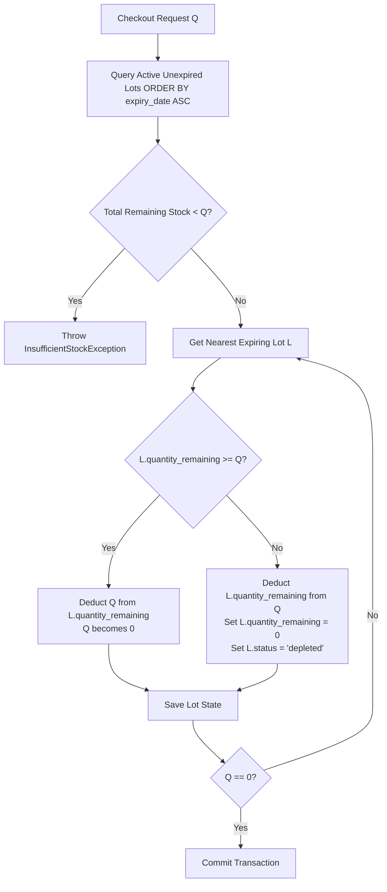

# Story 26.1-C: FEFO Allocation Planning (Scope Lock)

**Status**: `ACTIVE / PLANNING ONLY`  
**Epic Focus**: Epic 26 — Advanced Supply Chain, Expiry Tracking & Automated Procurement  
**Story Identifier**: Story 26.1-C  
**Goal**: Design the technical architecture, high-precision mathematical models, database concurrency strategy, and testing criteria for First-Expired-First-Out (FEFO) stock selection and depletion during sales transactions, without writing any functional code.

---

## 1. Goal and Purpose

This document freezes the technical specification, algorithmic flow, and concurrency design for the **FEFO (First-Expired, First-Out) Inventory Allocation Engine** before any checkout integration or deduction logic is written.

Developing a robust inventory selection engine requires:
1. **Absolute Financial Trust**: Ensuring quantities depleted from specific lots strictly match total product stock deductions, protecting Weighted Average Cost (WAC) calculations from historical discrepancy.
2. **Operational Safety**: Eliminating any logical pathway that allows expired batches to be allocated or sold at the POS.
3. **High-Concurrency Protection**: Preventing double-allocation race conditions where multiple cashiers sell the same product concurrently.
4. **Data Isolation Boundaries**: Restricting selection queries strictly to the active tenant and checkout branch context.

---

## 2. In-Scope vs. Out-of-Scope (Boundaries)

### In-Scope (Approved Planning Boundary)
1. **FEFO Selection Algorithm Design**: Database query contracts, filters, and chronological sort definitions (`expiry_date ASC`).
2. **Expired-Lot Exclusion Rules**: Logical constraints excluding any lots where `expiry_date <= CURRENT_DATE`.
3. **Partial Depletion Loop**: Mathematical logic (using high-precision `bcmath` operations) for distributing requested quantities across multiple lots.
4. **Pessimistic Locking & Concurrency Design**: Transactional isolation scopes, table indexing, and row-locking strategies to prevent race conditions.
5. **Audit Logging Scheme**: Standardizing immutable transaction trail payloads (`LOT_ALLOCATED`, `LOT_DEPLETED`) linked to POS checkouts.
6. **Adversarial Test Matrix**: Defining exhaustive testing boundary cases for split lot allocation, insufficient stock, exact quantities, expired lots, and concurrent checkout simulations.

### Out-of-Scope (Strictly Blocked from Story 26.1-C)
- **Active Code Scaffolding**: No functional PHP classes, migrations, or checkout controllers may be created during this planning slice.
- **POS Checkout UI / Front-end integration**: Modifying React views, cashier screens, or cart flows.
- **Near-Expiry Alert Schedulers**: Automated CRON/scheduler warnings or notifications for near-expiry stocks (deferred to later slices).
- **RMA & Supplier Return Logic**: Writing off expired stocks to supplier returns (Story 26.3).

---

## 3. FEFO Selection & Sorting Algorithm

When a product $P$ is checked out at branch $B$ for quantity $Q$, the system must fetch active, unexpired lots sorted by expiration date to allocate inventory.

### A. Database Query Specification
To retrieve valid candidate lots, the query must execute a single-pass filter with strict index alignment:

```sql
SELECT * FROM expiry_lots
WHERE tenant_id = :tenant_id
  AND branch_id = :branch_id
  AND product_id = :product_id
  AND status = 'active'
  AND quantity_remaining > 0.0000
  AND expiry_date > :current_date
ORDER BY expiry_date ASC, created_at ASC;
```

#### Selection Parameters:
- **Index Optimization**: Leverages the composite index `[tenant_id, branch_id, product_id, batch_code]` and `expiry_date` to ensure sub-millisecond execution times.
- **Tie-Breaker Clause**: In the rare event of identical expiration dates (`expiry_date` tie), the tie-breaker is `created_at ASC` (First-In, First-Out sequence).

---

## 4. High-Precision Recursive Partial Depletion Loop

Because a single checkout line might request more stock than is available in a single lot, the system must distribute the requested quantity recursively across multiple expiring lots.

### A. Depletion Flow Chart


### B. Algorithmic Pseudo-code (High-Precision `bcmath`)
All operations must use `bcmath` at scale `4` to prevent floating-point rounding errors:

```php
function allocateFEFO(string $tenantId, string $branchId, string $productId, string $requestedQty): array
{
    // 1. Fetch lots ordered by expiry_date ASC
    $lots = ExpiryLot::where('tenant_id', $tenantId)
        ->where('branch_id', $branchId)
        ->where('product_id', $productId)
        ->where('status', 'active')
        ->where('quantity_remaining', '>', 0)
        ->where('expiry_date', '>', now()->toDateString())
        ->orderBy('expiry_date', 'asc')
        ->orderBy('created_at', 'asc')
        ->lockForUpdate() // Pessimistic Lock
        ->get();

    $totalAvailable = '0.0000';
    foreach ($lots as $lot) {
        $totalAvailable = bcadd($totalAvailable, $lot->quantity_remaining, 4);
    }

    // 2. Insufficient stock block
    if (bccomp($totalAvailable, $requestedQty, 4) === -1) {
        throw new InsufficientStockException("Insufficient unexpired stock available.");
    }

    $remainingToDeduct = $requestedQty;
    $allocations = [];

    foreach ($lots as $lot) {
        if (bccomp($remainingToDeduct, '0.0000', 4) === 0) {
            break;
        }

        $lotRemaining = $lot->quantity_remaining;
        
        if (bccomp($lotRemaining, $remainingToDeduct, 4) >= 0) {
            // This lot has enough stock to fulfill the rest of the request
            $newRemaining = bcsub($lotRemaining, $remainingToDeduct, 4);
            $lot->quantity_remaining = $newRemaining;
            
            if (bccomp($newRemaining, '0.0000', 4) === 0) {
                $lot->status = 'depleted';
            }

            $allocations[] = [
                'expiry_lot_id' => $lot->id,
                'batch_code' => $lot->batch_code,
                'quantity_allocated' => $remainingToDeduct
            ];

            $lot->save();
            $remainingToDeduct = '0.0000';
        } else {
            // Partial depletion: empty this lot and move to the next
            $allocations[] = [
                'expiry_lot_id' => $lot->id,
                'batch_code' => $lot->batch_code,
                'quantity_allocated' => $lotRemaining
            ];

            $lot->quantity_remaining = '0.0000';
            $lot->status = 'depleted';
            $lot->save();

            $remainingToDeduct = bcsub($remainingToDeduct, $lotRemaining, 4);
        }
    }

    return $allocations;
}
```

---

## 5. Concurrency & Row-Locking Strategy

High-volume retail environments experience race conditions if two cashiers sell the same product at the same time. To prevent double-allocation:

1. **Pessimistic Locking (`lockForUpdate`)**:
   During the query phase of the allocation, the system must lock the candidate `expiry_lots` rows. This ensures that another concurrent database transaction cannot read or modify these records until the current checkout transaction either commits or rolls back.
2. **Transaction Scoping**:
   The allocation loop and subsequent `stock_movements` registrations must reside inside a single database transaction block:
   ```php
   DB::transaction(function () use ($tenantId, $branchId, $items) {
       foreach ($items as $item) {
           $allocations = $this->allocateFEFO($tenantId, $branchId, $item['product_id'], $item['quantity']);
           $this->registerStockMovements($item, $allocations);
       }
   });
   ```

---

## 6. Security, Isolation, and Audit Trail Design

### A. Tenant & Branch Isolation Scopes
- **Automatic Scoping**: All queries run against `ExpiryLot` must inherit the `BelongsToTenant` scope.
- **Context Integrity**: The `$branchId` passed to the allocation query must be extracted directly from the authenticated cashier's session, blocking arbitrary parameters.

### B. Audit Trail Payloads
Any stock depletion creates immutable audit trails in the `audit_logs` table:

```json
{
  "event": "LOT_DEDUCTED",
  "actor_id": "9a61b2b8-9366-41ff-80ea-1234567890ab",
  "branch_id": "bb657f20-91a1-4322-8089-a292d3fde77c",
  "details": {
    "product_id": "7c82c2d4-1a3b-48ae-94a2-e2c7a9775f0a",
    "total_quantity_requested": "15.0000",
    "allocations": [
      {
        "expiry_lot_id": "4cfc24e9-11c9-4a00-abfa-de657ac7801a",
        "batch_code": "BATCH-A",
        "quantity_allocated": "10.0000"
      },
      {
        "expiry_lot_id": "5dfe46aa-22fa-4b00-baef-ef879bd8902b",
        "batch_code": "BATCH-B",
        "quantity_allocated": "5.0000"
      }
    ]
  }
}
```

---

## 7. Adversarial Test Matrix

To guarantee robust code scaffolding in the next phase, we define our functional verification expectations beforehand:

| Scenario ID | Pre-State | Action | Expected Output |
| :--- | :--- | :--- | :--- |
| **TC-FEFO-001** | Lot A (expires in 10 days, qty = 10)<br>Lot B (expires in 20 days, qty = 10) | Request 5 units | Deduct 5 units from **Lot A**.<br>Lot A remaining = 5.<br>Lot B untouched. |
| **TC-FEFO-002** | Lot A (expires in 10 days, qty = 10)<br>Lot B (expires in 20 days, qty = 10) | Request 15 units | Deduct 10 from **Lot A** (status $\to$ `depleted`).<br>Deduct 5 from **Lot B** (remaining = 5). |
| **TC-FEFO-003** | Lot A (expires in 10 days, qty = 10)<br>Lot B (expires in 20 days, qty = 10) | Request 25 units | Throws `InsufficientStockException`. No database records modified. |
| **TC-FEFO-004** | Lot A (EXPIRED, qty = 10)<br>Lot B (expires in 20 days, qty = 10) | Request 5 units | Deduct 5 units from **Lot B**.<br>Lot A untouched and locked out. |
| **TC-FEFO-005** | Lot A (expires in 10 days, qty = 10) | Concurrent requests: Cashier A (5) & B (6) | **Cashier A** locks and deducts 5. **Cashier B** waits for lock, retrieves Lot A (qty=5), checks total, throws `InsufficientStockException`. |

---

## 8. Alignment & Scope Sign-Off

Story 26.1-C Planning is complete and locked because:
1. The **FEFO Selection Algorithm Query** is defined with optimization filters.
2. The **High-Precision Depletion Loop** is explicitly specified via pseudo-code utilizing `bcmath`.
3. The **Database Concurrency and Locking Strategy** is established.
4. **Tenant/Branch context boundaries** and audit log payloads are fully mapped.
5. The **Adversarial Test Matrix** is frozen to form the exact test assertions for the next implementation phase.
