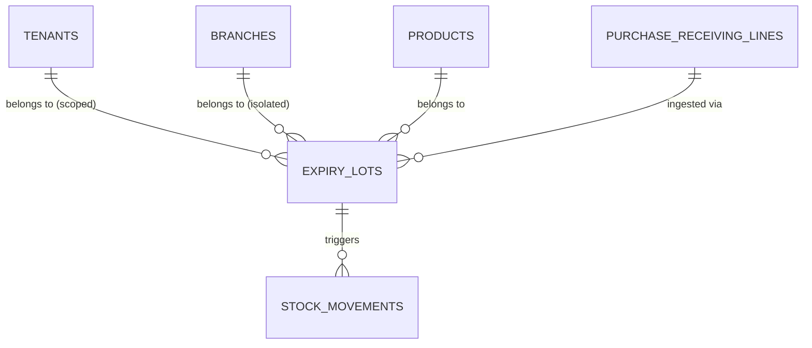
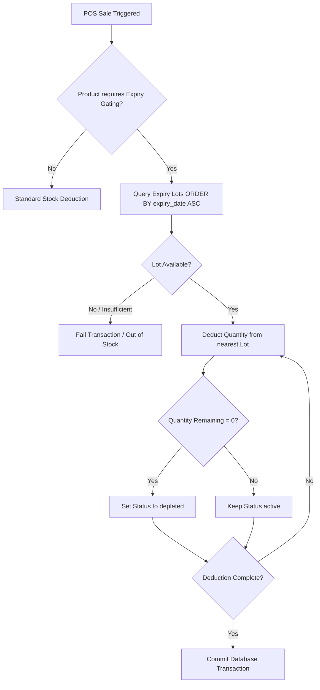

# Story 26.1: Expiry Lot & FEFO Ingestion Planning (Scope Lock)

**Status**: `ACTIVE / PLANNING ONLY`  
**Epic Focus**: Epic 26 — Advanced Supply Chain, Expiry Tracking & Automated Procurement  
**Story Identifier**: Story 26.1  
**Goal**: Design a secure, fail-closed, multi-tenant Expiry Lot tracking and First-Expiry-First-Out (FEFO) inventory ingestion and validation engine, without writing any functional code.

---

## 1. Goal and Purpose

This document locks the technical architecture, data model, business rules, API contracts, security boundaries, and test matrices for **Story 26.1: Expiry Lot FEFO Ingestion & Validation** before any database tables, models, or backend controllers are created.

Establishing this scope lock prevents:
1. **Inventory Valuation Errors**: Preventing un-tracked adjustments that could corrupt Weighted Average Cost (WAC) tracking during stock allocation or expiration.
2. **Operational Breaches**: Eliminating the risk of selling expired goods to customers at the POS.
3. **Data Leakage / Cross-Tenant Pollution**: Ensuring lot references and stock quantities are airtight and scoped to the active tenant and branch.

---

## 2. In-Scope vs. Out-of-Scope (Boundaries)

### In-Scope (Approved Planning Boundary)
1. **Expiry Lot Data Model**: Complete database schema and relationships supporting batch codes, production dates, expiry dates, and lot quantities.
2. **Receiving-Time Expiry Capture**: API endpoint structure, payload schemas, and backend validations for capturing expiry details during Purchase Receiving (Epic 20) ingestion.
3. **Fail-Closed Expired Stock Blocking**: Absolute logical block preventing expired lots from being selected or sold at POS.
4. **FEFO (First-Expiry-First-Out) Selection Algorithm**: Mathematical/logical rules for auto-allocating stock from the nearest-to-expire valid lots during POS checkout.
5. **Near-Expiry Alert Register**: Configurable threshold mapping and queries for identifying batches within critical warning windows.
6. **Audit & Compliance Logging**: Append-only log contract for lot state transitions (Ingested, Transferred, Deducted, Wasted, Expired).
7. **Tenant and Branch Isolation Guardrails**: Enforced tenant-scoping traits, database keys, and query filters.

### Out-of-Scope (Explicitly Blocked from Story 26.1)
- **Active Code Implementation**: No actual PHP classes, migrations, or JavaScript components may be written in this story.
- **Auto-Reorder Schedulers**: Auto-generation of Purchase Orders based on PAR limits (deferred to Story 26.2).
- **Supplier Returns (RMA) Processing**: Return of expired/damaged lots to suppliers (deferred to Story 26.3).
- **QuickBooks Accounts Payable Integration**: Synchronizing lot/batch costs to QuickBooks Online (deferred to Story 26.4).
- **Inter-Branch Transfers (IBTs)**: Physical transfer of lots between branches (deferred to Story 26.5).

---

## 3. Expiry Lot Data Model

To support traceablity and FEFO allocation, the database must introduce a granular, multi-tenant `expiry_lots` table linked to branch inventory.

### A. Database Entity-Relationship (ER)


### B. Table Schema: `expiry_lots`
| Column | Type | Attributes | Description |
| :--- | :--- | :--- | :--- |
| `id` | UUID | Primary Key | Canonical lot identifier. |
| `tenant_id` | UUID | Foreign Key, Indexed | SaaS owner separation. |
| `branch_id` | UUID | Foreign Key, Indexed | Location separation. |
| `product_id` | UUID | Foreign Key, Indexed | Mapped inventory item. |
| `purchase_receiving_line_id` | UUID | Foreign Key, Nullable | PO receiving source provenance. |
| `batch_code` | VARCHAR(64) | Indexed, Required | Supplier's production batch reference number. |
| `quantity_received` | DECIMAL(12,4) | Unsigned | Original quantity entered during receiving. |
| `quantity_remaining` | DECIMAL(12,4) | Unsigned | Active stock remaining in this specific lot. |
| `production_date` | DATE | Nullable | Optional production timestamp. |
| `expiry_date` | DATE | Indexed, Required | The absolute expiration date (must be after production/receiving). |
| `status` | VARCHAR(24) | Default: `'active'` | Active states: `'active'`, `'depleted'`, `'wasted'`, `'expired'`. |
| `created_at` | TIMESTAMP | | System ingestion timestamp. |
| `updated_at` | TIMESTAMP | | System update timestamp. |

> [!IMPORTANT]
> **Data Integrity Constraint**: A composite unique index on `[tenant_id, branch_id, product_id, batch_code]` is required to prevent duplicate batch registration within the same store environment.

---

## 4. Ingestion & Validation Rules

### A. Receiving-Time Expiry Capture (Epic 20 Integration)
During Purchase Receiving, if a product is marked as `requires_expiry_tracking` in the catalog, the receiving payload must include the expiry metadata block.

#### API Ingestion Schema (`POST /procurement/receiving/{receiving_id}/post`)
```json
{
  "receiving_id": "9a61b2b8-9366-41ff-80ea-1234567890ab",
  "items": [
    {
      "receiving_line_id": "bb657f20-91a1-4322-8089-a292d3fde77c",
      "product_id": "7c82c2d4-1a3b-48ae-94a2-e2c7a9775f0a",
      "quantity_received": 100.0000,
      "batch_code": "LOT-2026-05A",
      "production_date": "2026-05-10",
      "expiry_date": "2027-05-10"
    }
  ]
}
```

#### Ingestion Validation Logic:
1. **Perishable Check**: Verify `Product::requires_expiry_tracking` is true. If false, lot data is optional/ignored; if true, `batch_code` and `expiry_date` are **mandatory**.
2. **Chronological Validity**:
   - `expiry_date` must be a valid future date.
   - `expiry_date` must be strictly *after* the `production_date` (if provided).
   - `expiry_date` must be strictly *after* the current operational receiving date: `expiry_date > receiving_date`.
3. **Quantity Bounds**: `quantity_received` must be positive (> 0.0000).

---

## 5. First-Expiry-First-Out (FEFO) Selection Algorithm

When a sales transaction is executed at POS, the system must deduct inventory from the nearest expiring lots. 

### A. Deduct Selection Rule
For a product $P$ at branch $B$ and quantity requested $Q$:
1. Retrieve active expiry lots where:
   - `product_id = P`
   - `branch_id = B`
   - `quantity_remaining > 0`
   - `status = 'active'`
   - `expiry_date > CURRENT_DATE` (unexpired check)
2. Sort matching records chronologically: **Ascending** by `expiry_date` (nearest first).
3. Deduct systematically using a loop (high-precision `bcsub`):
   - Allocate up to the available lot quantity.
   - Set depleted lots to status `'depleted'` and `quantity_remaining = 0`.
   - Update remainder to the next closest expiring lot.
4. Record corresponding transactional `stock_movements` referencing the target `expiry_lot_id`.

### B. Code-Level Algorithmic Flow


---

## 6. Expired-Stock Blocking & Alert Register

### A. POS Selling Block
If a product has expired lots but no active valid lots, selling must be blocked at POS. 
* **Global Query Filter Constraint**: Introduce a middleware checks/helper that returns the total *sellable* stock (excluding expired lots).
* **Sellable Stock Formula**:
  $$\text{Sellable Stock} = \sum (\text{expiry\_lots.quantity\_remaining}) \quad \text{where } \text{expiry\_date} > \text{CURRENT\_DATE}$$

### B. Near-Expiry Alert Register
An active, branch-scoped system reporting register must show items reaching critical expiration zones.

#### Expiry Alert Tiers:
- 🟢 **Safe**: Expiry date > 90 days.
- 🟡 **Warning**: Expiry date within 31–90 days.
- 🔴 **Critical**: Expiry date within 0–30 days (automatically highlighted in POS inventory views and back-office dashboards).
- 💀 **Expired**: Expiry date $\le$ current system date (immediately isolated from POS and queued for waste write-offs).

---

## 7. Security, Isolation & Compliance

### A. Multi-Tenant and Branch Isolation Guardrails
- **Tenant Scope Isolation**: `ExpiryLot` must leverage the canonical `BelongsToTenant` trait.
- **Fail-Closed Fallback**: Any search, fetch, or allocation query without an active `tenant_id` context must throw a strict system-level exception (`TenantContextMissingException`).
- **Branch Restriction**: All stock lookups during POS sales must query exclusively against `branch_id` matching the authenticated cashier's context.

### B. Audit Trail Logging Schema
All lot state changes must be appended to the immutable system audit trail:
- **`LOT_INGESTED`**: Purchase Receiving created the lot.
- **`LOT_DEDUCTED`**: POS transaction subtracted quantity from the lot.
- **`LOT_WASTED`**: Inventory write-off for damaged or expired items.
- **`LOT_SYSTEM_EXPIRED`**: Automated system cron marked lot as expired.

---

## 8. Robust Testing Plan

Before implementing, we define a comprehensive testing checklist to prevent regressions:

### I. Unit & Domain Tests
- `test_lot_requires_expiry_date_when_tracked`: Ingesting a tracked product without an expiry date throws a validation exception.
- `test_expiry_date_cannot_be_in_past`: Verify receiving dates before the current system date are blocked.
- `test_fefo_allocation_order`: Seed three lots (expiring in 10, 20, and 30 days) and verify POS deduction selects the 10-day lot first.
- `test_lot_status_transition_to_depleted`: Assert that a lot with `quantity_remaining = 0` changes status to `'depleted'`.

### II. Multi-Tenant & Security Tests
- `test_cannot_access_other_tenant_expiry_lots`: Attempt to query expiry lots under Tenant B using Tenant A's connection, verify 403 / empty result.
- `test_cannot_sell_expired_stock`: Seed an expired lot and verify POS checkout returns a `422 Unprocessable` or `403 Forbidden` error.

---

## 9. Exit Criteria & Scope Approval

Story 26.1 Planning is formally complete and locked because:
1. The `expiry_lots` data model is mapped and documented.
2. Chronological chronological receiving and POS deduction rules are frozen.
3. The First-Expiry-First-Out (FEFO) order algorithm is defined.
4. Alerts, audit trails, and multi-tenant security gates are standard-locked.
5. The exit criteria provide a perfect architectural blueprint for actual code scaffolding in future stories.

---

### Story 26.1 Scope Lock Attestation
This planning lock is accepted and agreed upon by the development agent and human pairing owner. No implementation code will be generated during this iteration.
