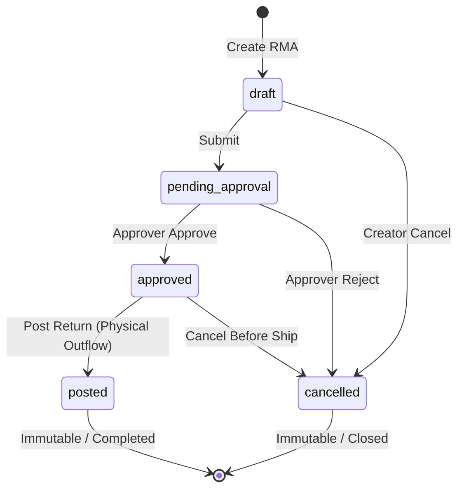

# Story 26.3-A: Supplier Returns / RMA Planning (Scope Lock)

**Status**: `ACTIVE / PLANNING ONLY`  
**Epic Focus**: Epic 26 — Advanced Supply Chain, Expiry Tracking & Automated Procurement  
**Story Identifier**: Story 26.3-A  
**Goal**: Author the complete database schemas, state machine lifecycles, high-precision mathematical cost adjustment models (WAC recalculation), lot-depletion rules, Debit Note payload formats, and verification test matrices for Supplier Returns / RMAs, without writing any functional code.

---

## 1. Goal and Purpose

This document freezes the technical design and architectural boundaries for the **Supplier Returns (RMA) & Weighted Average Cost (WAC) Protection Engine** before any migration, model, service class, or controller is written.

Reverse logistics in a multi-tenant environment requires absolute cost-accounting integrity. When physical goods are returned to a vendor (due to damage, near-expiry, or purchase variance), simply decrementing inventory is insufficient. We must:
1.  **Recalculate WAC Dynamically**: Adjust the remaining inventory valuation at the branch to prevent skewed gross-profit calculations, protecting WAC from historical degradation.
2.  **Enforce Historical Immutability**: Ensure that once a return is marked as `posted`, the document, lines, and accounting impacts are strictly read-only. Adjustments can only occur via offset returns or new receivings.
3.  **Strict Lot Deallocation**: Align returned quantities with the correct perishable expiry lots, ensuring lot-level counts accurately match the physical warehouse state.
4.  **Isolate Multi-Tenant Contexts**: Restrict RMA queries, document numbering sequences, and database locking strictly to the active tenant and branch context.

---

## 2. In-Scope vs. Out-of-Scope (Boundaries)

### In-Scope (Approved Planning Boundary)
1.  **RMA & Return Line Schemas**: Specification of relational structures, primary keys (UUIDs), indices, and constraint configurations.
2.  **RMA State Machine**: Definition of allowable lifecycles (`draft`, `pending_approval`, `approved`, `posted`, `cancelled`) and transition guards.
3.  **High-Precision WAC Recalculation Algorithm**: Precise mathematical formulations using `bcmath` at scale `4` to update the average unit cost of the remaining inventory pool.
4.  **Stock and Lot Depletion Mechanics**: Rules for decrementing branch inventories and updating `ExpiryLot` records (including FEFO fallback if no lot is explicitly passed).
5.  **Debit Note Data Contract**: Payload definitions for the printable, immutable Debit Note transaction voucher.
6.  **Adversarial Test Matrix**: Pre-defining test expectations for cost variance, stock underflows, lot-depletion limits, and multi-tenant security bypass attempts.

### Out-of-Scope (Strictly Blocked from Story 26.3-A)
-   **Active Code Scaffolding**: Creating migrations, PHP models, services, controllers, or database seeders.
-   **QuickBooks API Sync**: Implementing automated sync of Debit Notes to third-party ledgers (deferred to Story 26.4).
-   **Cashier POS Interface**: Adding return entry forms on cashier screens or retail registers (limited to back-office Procurement portals only).

---

## 3. Database Schema Design

To align with IPOS's core database standard, the RMA tables will utilize **UUID primary keys** and enforce strict foreign-key cascades.

### A. `supplier_returns` Table (RMA Header)
Defines the main return transaction record:

```sql
CREATE TABLE supplier_returns (
    id UUID PRIMARY KEY,
    tenant_id UUID NOT NULL,
    branch_id UUID NOT NULL,
    supplier_id UUID NOT NULL,
    purchase_receiving_id UUID NULL, -- Optional link to original received receipt
    document_number VARCHAR(255) NOT NULL, -- Format: RMA-BRANCHCODE-YYYYMMDD-SEQ
    status VARCHAR(50) NOT NULL DEFAULT 'draft', -- draft, pending_approval, approved, posted, cancelled
    return_date DATE NOT NULL,
    total_amount DECIMAL(19,4) NOT NULL DEFAULT 0.0000,
    notes TEXT NULL,
    
    created_by UUID NOT NULL,
    approved_by UUID NULL,
    approved_at TIMESTAMP NULL,
    posted_by UUID NULL,
    posted_at TIMESTAMP NULL,
    cancelled_by UUID NULL,
    cancelled_at TIMESTAMP NULL,
    
    created_at TIMESTAMP NULL,
    updated_at TIMESTAMP NULL,
    
    CONSTRAINT fk_returns_tenant FOREIGN KEY (tenant_id) REFERENCES tenants(id) ON DELETE CASCADE,
    CONSTRAINT fk_returns_branch FOREIGN KEY (branch_id) REFERENCES branches(id) ON DELETE CASCADE,
    CONSTRAINT fk_returns_supplier FOREIGN KEY (supplier_id) REFERENCES suppliers(id) ON DELETE CASCADE,
    CONSTRAINT fk_returns_receiving FOREIGN KEY (purchase_receiving_id) REFERENCES purchase_receivings(id) ON DELETE SET NULL,
    CONSTRAINT fk_returns_creator FOREIGN KEY (created_by) REFERENCES users(id) ON DELETE CASCADE,
    CONSTRAINT fk_returns_approver FOREIGN KEY (approved_by) REFERENCES users(id) ON DELETE SET NULL,
    CONSTRAINT fk_returns_poster FOREIGN KEY (posted_by) REFERENCES users(id) ON DELETE SET NULL,
    CONSTRAINT fk_returns_canceller FOREIGN KEY (cancelled_by) REFERENCES users(id) ON DELETE SET NULL,
    
    CONSTRAINT uq_returns_tenant_doc UNIQUE (tenant_id, document_number)
);

CREATE INDEX idx_returns_tenant_branch_status ON supplier_returns (tenant_id, branch_id, status);
CREATE INDEX idx_returns_supplier ON supplier_returns (supplier_id);
```

### B. `supplier_return_lines` Table (RMA Lines)
Defines individual product line items being returned:

```sql
CREATE TABLE supplier_return_lines (
    id UUID PRIMARY KEY,
    supplier_return_id UUID NOT NULL,
    product_id UUID NOT NULL,
    expiry_lot_id UUID NULL, -- Linked if returning from a specific batch
    
    quantity DECIMAL(12,4) NOT NULL,
    unit_cost DECIMAL(19,4) NOT NULL, -- Returned unit price (typically original purchase cost)
    line_total DECIMAL(19,4) NOT NULL, -- quantity * unit_cost
    
    batch_code VARCHAR(255) NULL, -- Historical snapshot of lot number
    expiry_date DATE NULL, -- Historical snapshot of lot expiry date
    
    created_at TIMESTAMP NULL,
    updated_at TIMESTAMP NULL,
    
    CONSTRAINT fk_lines_return FOREIGN KEY (supplier_return_id) REFERENCES supplier_returns(id) ON DELETE CASCADE,
    CONSTRAINT fk_lines_product FOREIGN KEY (product_id) REFERENCES products(id) ON DELETE CASCADE,
    CONSTRAINT fk_lines_lot FOREIGN KEY (expiry_lot_id) REFERENCES expiry_lots(id) ON DELETE SET NULL
);

CREATE INDEX idx_lines_return ON supplier_return_lines (supplier_return_id);
CREATE INDEX idx_lines_product ON supplier_return_lines (product_id);
```

---

## 4. RMA Lifecycle & State Machine Transitions

The lifecycle of an RMA is governed by a strict transition sequence enforced via a state machine pattern:



### State Machine Transition Rules & Field Enforcements:

| Initial State | Target State | Permitted Roles | Actions Executed / System Guardrails |
| :--- | :--- | :--- | :--- |
| **None** | `draft` | `Procurement Manager`<br>`Tenant Owner` | Creates RMA header and lines. Generates tentative `document_number`. No database inventory modifications occur. |
| **`draft`** | `pending_approval` | `Procurement Manager`<br>`Tenant Owner` | Freezes lines for editing. Asserts all quantities are $> 0.0000$ and costs $\ge 0.0000$. |
| **`pending_approval`** | `approved` | `Tenant Owner`<br>`Procurement Manager` (if not creator) | Sets `approved_by` and `approved_at`. Ready for physical shipment. |
| **`approved`** | `posted` | `Procurement Manager`<br>`Tenant Owner` | **Atomic Transition Boundary**:<br>1. Decrements physical stock counts.<br>2. Recalculates branch WAC.<br>3. Depletes specific or FEFO expiry lots.<br>4. Writes inventory movements.<br>5. Generates the final Debit Note.<br>6. Logs the completed event to `AuditLogger`. |
| **`draft`**<br>**`pending_approval`**<br>**`approved`** | `cancelled` | Creator or Approver | Sets `cancelled_by` and `cancelled_at`. No inventory or costing changes occur. Relinquishes any locks. |
| **`posted`**<br>**`cancelled`** | *Any State* | *None* | **Strictly Prohibited**. Transitioning out of a terminal state throws a `RuntimeException`. |

---

## 5. High-Precision WAC Recalculation Algorithm

When a return is `posted`, stock is permanently deducted. To protect average costing, we subtract the value of the returned goods from our current inventory value pool and divide by the remaining stock pool.

### A. Mathematical Formulation
Let:
-   $Q_{before}$ = Inventory quantity before return posting (from `branch_inventories.current_stock`)
-   $WAC_{before}$ = Weighted Average Cost before return posting (from `branch_inventories.average_cost`)
-   $Q_{returned}$ = Quantity returned to supplier (from `supplier_return_lines.quantity`)
-   $C_{returned}$ = Original unit purchase cost of returned items (from `supplier_return_lines.unit_cost`)

The new quantity remaining is:
$$Q_{after} = Q_{before} - Q_{returned}$$

The new inventory value remaining is:
$$Value_{after} = (Q_{before} \times WAC_{before}) - (Q_{returned} \times C_{returned})$$

The recalculated WAC ($WAC_{after}$) is:
$$WAC_{after} = \frac{Value_{after}}{Q_{after}} = \frac{(Q_{before} \times WAC_{before}) - (Q_{returned} \times C_{returned})}{Q_{before} - Q_{returned}}$$

### B. High-Precision Guardrails (`bcmath` scale 4)
Because inventory quantities and costs are stored with up to 4 decimal places, float rounding error accumulation is mathematically unacceptable. All operations must implement high-precision calculations.

#### WAC Recalculation Pseudo-code:
```php
public function recalculateWacOnReturn(
    string $qBefore, 
    string $wacBefore, 
    string $qReturned, 
    string $cReturned
): string {
    // Guard 1: Return quantity must be positive
    if (bccomp($qReturned, '0.0000', 4) <= 0) {
        return $wacBefore;
    }

    // Calculate remaining quantity
    $qAfter = bcsub($qBefore, $qReturned, 4);

    // Guard 2: If remaining stock is <= 0.0000, all inventory is depleted.
    // The WAC does not change (retains its last calculated average cost) to prevent division by zero or negative costs.
    if (bccomp($qAfter, '0.0000', 4) <= 0) {
        return $wacBefore;
    }

    // Calculate total value before return
    $valBefore = bcmul($qBefore, $wacBefore, 4);

    // Calculate total value returned
    $valReturned = bcmul($qReturned, $cReturned, 4);

    // Calculate new total value remaining
    $valAfter = bcsub($valBefore, $valReturned, 4);

    // Guard 3: Prevent negative value pool (due to tiny numeric precision offsets)
    if (bccomp($valAfter, '0.0000', 4) < 0) {
        $valAfter = '0.0000';
    }

    // Calculate new WAC
    return bcdiv($valAfter, $qAfter, 4);
}
```

---

## 6. Stock & Expiry Lot Depletion Rules

Upon transitioning to `posted`, the system executes inventory deductions atomically:

### A. Branch Inventory Modification
For each return line:
1.  Verify that the corresponding `BranchInventory` record exists.
2.  Lock the row for update: `BranchInventory::where(...)->lockForUpdate()->first()`.
3.  Assert that current stock is sufficient for return ($Q_{before} \ge Q_{returned}$). If stock is insufficient, throw a `ValidationException` blocking the post.
4.  Compute the new WAC using `recalculateWacOnReturn()`.
5.  Decrement current stock: $Q_{after} = Q_{before} - Q_{returned}$.
6.  Save `average_cost = WAC_after` and `current_stock = Q_after`.
7.  Register a negative record in `inventory_movements`:
    - `movement_type`: `'supplier_return'`
    - `quantity_change`: `-$qReturned` (negative sign indicating stock outflow)
    - `source_type`: `SupplierReturn::class`
    - `source_id`: `$supplierReturn->id`

### B. Perishable Expiry Lot Depletion
If the returned product has `expiry_tracking_enabled = true`:

#### Scenario 1: Specific `expiry_lot_id` is linked to the return line
1.  Query and lock the lot row: `ExpiryLot::where('id', $expiryLotId)->lockForUpdate()->firstOrFail()`.
2.  Assert that the lot has enough remaining stock ($L.quantity\_remaining \ge Q_{returned}$). If not, throw a `ValidationException`.
3.  Decrement the lot: $L.quantity\_remaining = L.quantity\_remaining - Q_{returned}$.
4.  If $L.quantity\_remaining == 0.0000$, set $L.status = 'depleted'$. Save lot record.

#### Scenario 2: No specific lot is linked (General Return fallback)
1.  To prevent operational blocking while maintaining batch track integrity, execute automatic **FEFO (First-Expired, First-Out)** lot deallocation:
    - Query active lots belonging to this tenant, branch, and product:
      ```sql
      SELECT * FROM expiry_lots
      WHERE tenant_id = :t_id AND branch_id = :b_id AND product_id = :p_id
        AND quantity_remaining > 0.0000 AND status = 'active'
      ORDER BY expiry_date ASC, created_at ASC
      FOR UPDATE;
      ```
    - Recursively deplete quantity from the nearest expiring lots until the return request is fully satisfied, saving each lot state. If total available unexpired lot quantity is insufficient, throw a `ValidationException`.

---

## 7. Debit Note Schema & JSON Payload Design

Once posted, the system generates an immutable Debit Note representing the financial claim against the supplier. This data structure will be serialized into the QuickBooks queue in the subsequent story.

### Debit Note Data Contract Payload:
```json
{
  "debit_note_number": "RMA-MNL-20260518-0002",
  "rma_id": "8c91b2b8-9366-41ff-80ea-9876543210ab",
  "tenant_id": "4cfc24e9-11c9-4a00-abfa-de657ac7801a",
  "branch": {
    "id": "bb657f20-91a1-4322-8089-a292d3fde77c",
    "code": "MNL",
    "name": "Manila Central Branch"
  },
  "supplier": {
    "id": "5dfe46aa-22fa-4b00-baef-ef879bd8902b",
    "code": "SUP-XYZ",
    "name": "XYZ Wholesale Distributors"
  },
  "original_receiving_number": "GRV-MNL-20260515-0001",
  "return_date": "2026-05-18",
  "totals": {
    "items_returned": 2,
    "total_quantity": "25.0000",
    "grand_total_claim": "450.0000"
  },
  "lines": [
    {
      "product_id": "7c82c2d4-1a3b-48ae-94a2-e2c7a9775f0a",
      "sku": "PROD-A1",
      "name": "Premium Flour (25kg)",
      "quantity_returned": "10.0000",
      "unit_cost": "25.0000",
      "line_total": "250.0000",
      "lot_details": {
        "expiry_lot_id": "2dca971a-6421-41ee-8651-7f89bde0902c",
        "batch_code": "LOT-FLOUR-A2",
        "expiry_date": "2026-12-31"
      }
    },
    {
      "product_id": "8d82c2d4-2a3b-48ae-94a2-e2c7a9775f0b",
      "sku": "PROD-B2",
      "name": "Unsalted Butter (10kg)",
      "quantity_returned": "15.0000",
      "unit_cost": "13.3333",
      "line_total": "200.0000",
      "lot_details": {
        "expiry_lot_id": "3ecb971a-7421-41ee-8651-7f89bde0902d",
        "batch_code": "LOT-BUTTER-B1",
        "expiry_date": "2026-09-30"
      }
    }
  ],
  "posted_by": {
    "user_id": "9a61b2b8-9366-41ff-80ea-1234567890ab",
    "name": "John Doe (Procurement Manager)"
  }
}
```

---

## 8. Tenant, Branch, and Supplier Isolation

Strict multi-tenant security gates are integrated into the database logic:
1.  **Strict Context Invalidation**: The active `tenant_id` and `branch_id` must be resolved from the stateful `TenantContext` service container. It is strictly blocked to bind them from URL route parameters or POST inputs.
2.  **Cross-Tenant Verification**: If a user attempts to retrieve an RMA or post a return containing a `supplier_id` or `product_id` belonging to a different tenant context, the database validation query will throw a `RuntimeException` or fail-closed 403 authorization error.
3.  **RBAC Gate Constraints**:
    - Only `Tenant Owner` and `Procurement Manager` roles are authorized to invoke `/procurement/rma/*` endpoints.
    - `Cashiers` attempting access will receive an immediate `CheckPermission` HTTP 403 Forbidden exception.

---

## 9. Adversarial Test Matrix

To guarantee robust code scaffolding in the next phase, we define our functional verification expectations beforehand:

| Scenario ID | Pre-State | Action | Expected Output |
| :--- | :--- | :--- | :--- |
| **TC-RMA-001** | Inventory (Qty = 100, WAC = 10.0000)<br>RMA lines (Qty = 10, cost = 10.0000) | Post RMA Return | **Normal Return (No Variance)**:<br>- Remaining Qty = 90<br>- Recalculated WAC = 10.0000<br>- Document status $\to$ `posted`. |
| **TC-RMA-002** | Inventory (Qty = 10, WAC = 20.0000)<br>RMA lines (Qty = 5, cost = 10.0000) | Post RMA Return | **High-Cost Variance Return**:<br>- Remaining Qty = 5<br>- Recalculated WAC = 30.0000 (Remaining stock value increases because cheaper stock was returned). |
| **TC-RMA-003** | Inventory (Qty = 5, WAC = 10.0000)<br>RMA lines (Qty = 10, cost = 10.0000) | Attempt to Post RMA | **Block Insufficient Stock**:<br>- Throws `ValidationException`. Transaction rolls back.<br>- Inventory remains untouched. |
| **TC-RMA-004** | Lot A (qty = 10, remaining = 10)<br>RMA line points to Lot A (Qty = 5) | Post RMA Return | **Perishable Lot Decrement**:<br>- Lot A remaining = 5.<br>- No other lots modified. |
| **TC-RMA-005** | RMA status = `posted` | Attempt to PUT /edit lines or POST status | **Immutability Guard**:<br>- Throws `RuntimeException` blocked at model level. No change occurs. |
| **TC-RMA-006** | Tenant A logged in.<br>RMA ID belongs to Tenant B. | Attempt to GET or POST to Tenant B's RMA ID | **Cross-Tenant Fail-Closed**:<br>- Throws `ModelNotFoundException` or `RuntimeException`. Strict context boundaries enforced. |

---

## 10. Alignment & Scope Sign-Off

Story 26.3-A Planning is complete and locked because:
1.  The **RMA and Return Line Schemas** are frozen with UUIDs and indexing profiles.
2.  The **WAC Recalculation Pseudo-code** using high-precision `bcmath` is fully defined.
3.  The **Stock and Lot Depletion Mechanics** are mapped including FEFO fallbacks.
4.  The **Debit Note Payload Contract** is verified.
5.  **Multi-Tenant context rules** and RBAC boundaries are fully defined.
6.  The **Adversarial Test Matrix** is frozen to form the exact test assertions for the next implementation phase.
