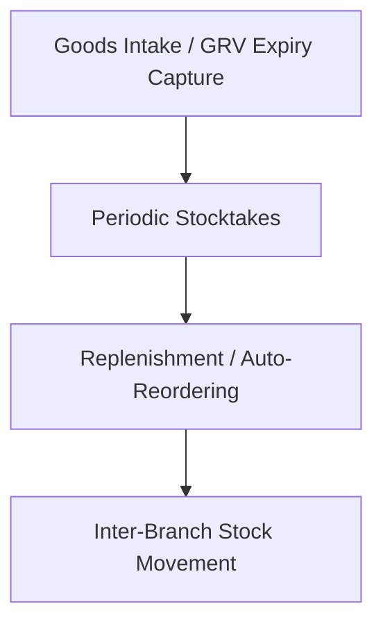

# IPOS End-to-End Role-Based User Guide

Welcome to the **IPOS User Enablement Guide**. This comprehensive document is organized by system roles in alignment with our Role-Based Access Control (RBAC) architecture. Follow these step-by-step operational workflows to ensure high-integrity, zero-loss retail and corporate supply chain operations.

---

## Table of Contents
1. [System Roles & Permissions Matrix](#1-system-roles--permissions-matrix)
2. [Cashier User Guide (Front-of-House Terminal)](#2-cashier-user-guide-front-of-house-terminal)
3. [Branch Manager User Guide (Store Operations)](#3-branch-manager-user-guide-store-operations)
4. [Accountant User Guide (Financials & QBO Integration)](#4-accountant-user-guide-financials--qbo-integration)
5. [Owner/Admin User Guide (Global Control)](#5-owneradmin-user-guide-global-control)
6. [Operational Troubleshooting & Common FAQs](#6-operational-troubleshooting--common-faqs)

---

## 1. System Roles & Permissions Matrix

The IPOS system enforces strict logical isolation and capability authorization. The table below outlines what functions each role is authorized to perform:

| Feature / Capability | Cashier | Branch Manager | Accountant | Owner/Admin |
| :--- | :---: | :---: | :---: | :---: |
| Access POS Terminal & Sales | ✅ | ✅ | ❌ | ✅ |
| Manage Own Cash Drawer | ✅ | ✅ | ❌ | ✅ |
| Approve Shifts & Voids | ❌ | ✅ | ❌ | ✅ |
| Initialize & Post Stocktakes | ❌ | ✅ | ❌ | ✅ |
| Capture Expiry Lots on Intake | ❌ | ✅ | ❌ | ✅ |
| Authorize Inter-Branch Transfers | ❌ | ✅ | ❌ | ✅ |
| Match AP Invoices (3-Way) | ❌ | ❌ | ✅ | ✅ |
| Manage QBO Account Mapping | ❌ | ❌ | ✅ | ✅ |
| Configure Products & Suppliers | ❌ | ❌ | ❌ | ✅ |
| Provision Tenant Users & RBAC | ❌ | ❌ | ❌ | ✅ |

---

## 2. Cashier User Guide (Front-of-House Terminal)

As a **Cashier**, you are the primary face of the terminal checkout. Your interface is optimized for speed, precision, and visual simplicity.

### 2.1 Starting Your Day: Opening Your Shift
Before scanning any items, you must initialize your cash drawer terminal:
1.  Navigate to the POS terminal URL and log in using your unique PIN.
2.  On the **Shift Initialization** popup, enter your **Opening Float** amount (e.g., $100.00 base cash in drawer).
3.  Click **[Open Shift]**.
4.  *Visual Verification*: Check that the top status bar displays a green light with `Shift Active: [Your Name]`.

### 2.2 Processing a Sale & FEFO Automatic Expiry Lot Allocation
IPOS prevents stock spoilage automatically by utilizing First-Expired, First-Out (FEFO) rules:
1.  Scan item barcodes or click on the product tiles in the POS grid.
2.  As items are added to the cart, the system automatically checks batch lots in the database and reserves stock from the **earliest-expiring batch**.
3.  Click **[Pay]** to open the payment tendering panel.
4.  Select the customer's payment method:
    *   **Cash**: Enter amount tendered and calculate change.
    *   **Digital / E-Wallet (GCash, PayMaya)**: Verify transaction reference ID before finalizing.
5.  Click **[Complete Transaction]** to print the receipt and open the cash drawer.

### 2.3 Restricting Operations: Manager Overrides
Certain operations represent risk vectors and are strictly blocked for standard Cashiers:
*   **Applying Custom Discounts** (beyond standard product promos)
*   **Voiding a Completed Transaction**
*   **Issuing a Customer Refund**

**How to get a Manager Override:**
1.  Trigger the blocked action (e.g., click **[Void Sale]**).
2.  A manager authorization popup will display.
3.  Have your **Branch Manager** scan their supervisor barcode or type in their administrative PIN.
4.  Once authorized, the operation will complete immediately, and an audit trail log is captured under the manager’s name.

### 2.4 Ending Your Day: Shift Closing & Reconciliations
At the end of your shift, you must reconcile your cash drawer:
1.  Click **[Close Shift]** in the terminal sidebar.
2.  Perform a physical count of all tenders inside your drawer:
    *   Count Cash and enter the total.
    *   Reconcile digital wallet receipts.
3.  Type these amounts into the **Closing Reconciliation** form.
4.  Click **[Submit Shift for Review]**.
5.  The terminal will print a physical **X-Read** (preliminary summary) or **Z-Read** (final shift summary) report showing any cash discrepancies (Overages/Shortages).

---

## 3. Branch Manager User Guide (Store Operations)

As a **Branch Manager**, you supervise shift operations, manage physical inventory, handle goods intake, and execute branch-to-branch stock transfers.

### 3.1 Approving Cashier Shifts
At the end of the day, review and approve submitted cashier shifts:
1.  Navigate to the Back Office and select **Store Operations > Shift Audits**.
2.  Select a shift in `Pending Review` status.
3.  Analyze the **Shift Reconciliation Summary** to audit discrepancies.
4.  Click **[Approve Shift]** to seal the Z-Report and lock the shift history from future mutations.

### 3.2 Goods Intake: Receiving Shipments & Capturing Expiry Lots
When a supplier shipment arrives, you must log it under a **Goods Received Voucher (GRV)**:
1.  Navigate to **Procurement > Goods Receiving** and click **[New GRV]**.
2.  Select the active Supplier and matching Purchase Order number.
3.  For each line item received, enter the **Quantity Received**, the **Batch/Lot Number**, and the **Expiration Date**.
    > [!WARNING]
    > IPOS gates all perishable items. You will be blocked from posting the GRV if any lot expiry field is left blank.
4.  Click **[Post GRV]** to commit the stock. The WAC of the items will update automatically, and the lots will instantly become active for FEFO POS depletion.

### 3.3 Running a Physical Stocktake Count
Initialize and execute store inventory audits:
1.  Navigate to **Inventory > Stocktakes** and click **[Initialize Stocktake]**.
2.  Select **Full Count** or target specific **Product Categories**.
3.  Assign staff to print count sheets and enter physical quantities in the **Count Entry** module.
4.  Review the **Variance Report** (System Stock vs. Physical Count).
5.  Select a reason code for adjustments (e.g. *Damaged*, *Spoiled*, or *Shrinkage*).
6.  Click **[Approve & Post Adjustments]** to synchronize physical and digital inventory.

### 3.4 Executing Inter-Branch Transfers (IBTs)
To move stock to another store branch:
1.  Navigate to **Operations > Stock Transfers (IBTs)** and click **[Create Transfer Request]**.
2.  Select the **Destination Branch** and add items.
3.  Click **[Dispatch Transfer]**. The system deducts stock from your branch immediately and moves it to `In-Transit` status.
4.  **Upon Receipt at Target Store**: The receiving branch manager opens the IBT, verifies quantities, and clicks **[Post Receipt]**.
5.  *WAC Cost Valuation*: Target WAC is automatically recalculated upon receipt using the source branch's frozen cost basis.

---

## 4. Accountant User Guide (Financials & QBO Integration)

As an **Accountant**, you reconcile financial daily reports, audit AP liabilities, map ledger accounts, and manage integration outboxes.

### 4.1 Reconciling Settlements & Daily Sales
IPOS isolates daily sales inside **Settlement Periods** to prevent back-dated data mutations:
1.  Navigate to **Financials > Settlement Periods**.
2.  Audit total cash, digital wallets, taxes, and discounts collected across all active branches.
3.  Verify that all active POS shifts for the day have been approved by store managers.
4.  Click **[Seal Settlement Period]** to close the books for that date. This action is irreversible.

### 4.2 Accounts Payable: Executing 3-Way Matching
To safeguard business cash flow, verify supplier invoices before payment:
1.  Navigate to **Procurement > 3-Way Matching Engine**.
2.  Select an incoming **Supplier Invoice**.
3.  The engine will dynamically match it against the corresponding **Purchase Order (PO)** and **Goods Received Voucher (GRV)**.
4.  Audit the matching indicators:
    *   **Green**: Quantities and unit costs match perfectly.
    *   **Red Flag**: Discrepancies exceed configured tolerance thresholds (e.g. unit cost drifted by >2%).
5.  *Handling Discrepancies*: Reject the invoice or request a Credit Note from the supplier.
6.  *Approval*: Once matched and approved, click **[Approve Liability]** to queue the invoice for QuickBooks Online accounts payable synchronization.

### 4.3 Monitoring the QuickBooks Online (QBO) Accounting Outbox
Our integration outbox isolates transactional data and supports safe retry mechanisms:
1.  Navigate to **Integrations > QuickBooks Sync Dashboard**.
2.  Audit the ledger tables:
    *   **Pending Queue**: Transactions waiting to sync.
    *   **Synced**: Successfully posted invoices, payments, and supplier returns.
    *   **Failed**: Flagged records with API exceptions.
3.  *Fixing Failures*: Open the error message (e.g. *Missing QBO Account Mapping*). Fix the underlying chart of accounts mapping, then click **[Retry Sync]**.

---

## 5. Owner/Admin User Guide (Global Control)

As an **Owner / Admin**, you hold complete global operational control over the tenant account, configurations, corporate analytics, and platform governance.

### 5.1 Provisioning Users & Role Assignments (RBAC)
Manage staff access profiles across all store branches:
1.  Navigate to **Administration > User Management**.
2.  Click **[Invite User]** and enter their corporate email.
3.  Select their primary assigned **Branch** (or select *All Branches* for corporate roles).
4.  Assign their **Role Profile**:
    *   **Cashier**: Limited to POS terminal, blocked from back office.
    *   **Branch Manager**: Branch operations, inventory intakes, and local IBTs.
    *   **Accountant**: Accounting outbox, QBO configurations, and 3-way matching.
    *   **Owner/Admin**: Full platform access.

### 5.2 Building & Publishing Custom POS Layouts
Design intuitive cashier grids to optimize speed:
1.  Navigate to **Catalog > POS Layout Builder**.
2.  Drag and drop product category grids, popular items, and discount tiles.
3.  Click **[Save Layout Draft]**.
4.  Under the **Publishing Sidebar**, select target branches and click **[Publish POS Layout]**.
5.  *Visual Verification*: Selected terminals will automatically refresh and download the new layout design in real-time.

### 5.3 Corporate Multi-Branch Analytics
Monitor your business performance at scale:
1.  Navigate to the **Pulse Dashboard**.
2.  Use filters to compare gross sales, profit margins, inventory levels, and stock turn rates across multiple store branches in real-time.
3.  Click **[Export Financial Audit]** to download historical ledger CSVs.

### 5.4 Platform Governance & Auditing Rollbacks
Audit security and configuration logs:
1.  Navigate to **Governance > Audit Logs**.
2.  Search logs by User, Action type, or Timestamp range.
3.  Review administrative rollbacks or structural changes (e.g., changes to product unit cost baselines or supplier directory edits).

---

## 6. Operational Troubleshooting & Common FAQs

### Q1: A cashier is unable to process checkouts, and the terminal displays a "No Layout Available" warning.
*   **Cause**: The POS Layout has not been published to that specific branch.
*   **Resolution**: Log in as an **Owner/Admin**, navigate to the **POS Layout Builder**, open your active layout, click the publishing sidebar, tick the cashier's branch, and click **[Publish Layout]**.

### Q2: An IBT is stuck in "In-Transit" status.
*   **Cause**: The source store dispatched the shipment, but the destination branch has not physically counted and accepted the receipt.
*   **Resolution**: Have the **Destination Branch Manager** navigate to **Store Operations > Stock Transfers**, locate the pending transfer, verify the items received, and click **[Post Receipt]**.

### Q3: An invoice is flagged with "Tolerance Limit Exceeded" during 3-Way matching.
*   **Cause**: The unit cost on the supplier invoice is higher than the unit cost locked on the original Purchase Order, exceeding the allowed deviation percentage.
*   **Resolution**: Reject the invoice and request a corrected copy, or have an authorized **Owner/Admin** enter their credentials to override the warning flag and manually post the liability.

### Q4: QuickBooks Online sync dashboard shows "Failed" with a mapping error.
*   **Cause**: A payment method (like a new digital wallet) or tax code has been used at the POS but does not have a mapped ledger account inside QuickBooks.
*   **Resolution**: An **Accountant** must navigate to **Integrations > Account Mapping**, assign the new tender type to its matching QBO account, and click **[Retry Sync]**.
