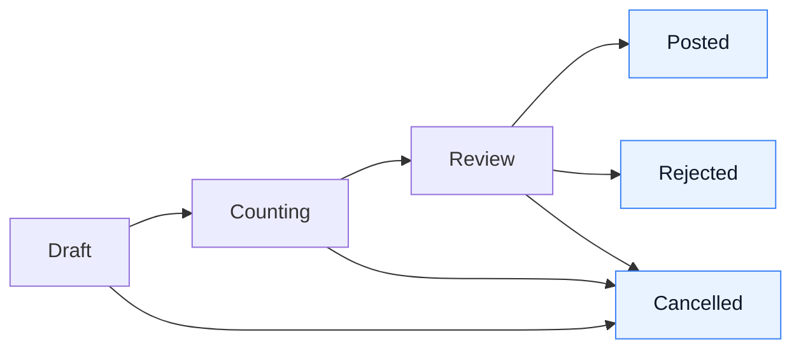
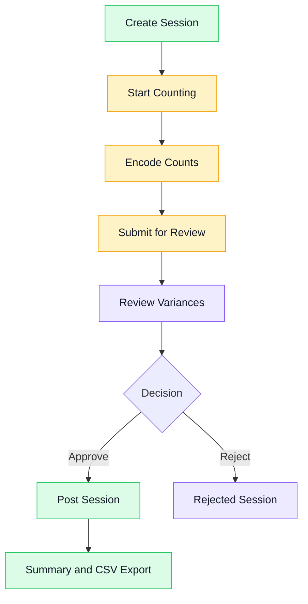

# Stocktake User Guide (Client Version)

## 1. What This Guide Is For

This guide is for store teams and managers who need to run Stocktake from start to finish.

It explains:
1. Who does what
2. What each Stocktake status means
3. How to run a Stocktake properly
4. How to review and post results
5. How to export reports
6. What to do when something goes wrong

This is an operations guide, not a technical guide.

## 2. Roles and Responsibilities

### Counter

1. Performs physical counting
2. Enters counted quantities
3. Adds remarks when needed
4. Submits session for review

### Reviewer

1. Reviews variance lines
2. Adds reason codes for differences
3. Rejects session if issues are found
4. Endorses session for posting

### Poster or Manager

1. Posts approved Stocktake session
2. Confirms inventory has been updated
3. Reviews summary and export output for audit files

## 3. Stocktake Statuses (Simple Meaning)

1. Draft: Session created, not started
2. Counting: Team is actively counting and encoding
3. Review: Counting finished, waiting for review decision
4. Posted: Finalized and inventory updated
5. Cancelled: Stopped and closed, no inventory update
6. Rejected: Sent back due to quality issues

Final statuses are:
1. Posted
2. Cancelled
3. Rejected

## 4. End-to-End Process

### Step 1: Create Session

1. Go to Inventory then Stocktake
2. Click New Stocktake
3. Add optional notes for context
4. Save

Result:
1. Session is in Draft status

### Step 2: Start Counting

1. Open the draft session
2. Click Start Counting

Result:
1. System creates line items for current branch inventory snapshot
2. Session moves to Counting

### Step 3: Encode Counts

1. Counter enters counted quantity per item
2. Counter adds remarks where needed
3. Save progress regularly

Important:
1. Do not leave required lines blank
2. Use consistent unit practice in physical counting

### Step 4: Submit for Review

1. Confirm all lines are counted
2. Click Submit for Review

Result:
1. Session moves to Review

### Step 5: Review Variances

1. Reviewer opens Review page
2. For all non-zero variance lines, select reason code
3. If reason is Other, add clear remarks
4. Decide whether to Reject or move forward for posting

### Step 6: Post Session

1. Poster validates review completeness
2. Click Post

Result:
1. Inventory is updated
2. Session moves to Posted
3. Inventory movement entries are recorded for audit

### Step 7: Summary and Export

1. Open Summary for final view
2. Export Variance CSV for records
3. Save export in your branch audit folder

### 4.1 Visual Workflow Map

Use this as the quick visual of the full cycle:



### 4.2 Role-Based Visual Guide

Use this to explain who acts at each stage:



### 4.3 Screenshot Storyboard (Insert Into Training Deck or SOP)

Capture screenshots in this order so the guide is easy for branch teams to follow:

1. Stocktake session list page
2. New Stocktake button and create form
3. Draft session detail page
4. Start Counting action confirmation
5. Counting screen with quantity entry fields
6. Submit for Review action
7. Review screen with reason code selector
8. Post action and success confirmation
9. Summary page with totals
10. Export Variance CSV action

Recommended naming convention:
1. stocktake-01-session-list.png
2. stocktake-02-create-session.png
3. stocktake-03-draft-session.png
4. stocktake-04-start-counting.png
5. stocktake-05-counting-screen.png
6. stocktake-06-submit-review.png
7. stocktake-07-review-reasons.png
8. stocktake-08-post-session.png
9. stocktake-09-summary.png
10. stocktake-10-export-csv.png

Caption template for each screenshot:
1. Screen Name
2. Who uses this screen
3. What to do on this screen
4. What success looks like

### 4.4 How To Capture Screenshots (Recommended)

Follow this process so all branches produce consistent visuals:

1. Use a staging or training account, not production cashier account
2. Set browser zoom to 100%
3. Use desktop view and keep sidebar visible
4. Capture full app window, not cropped widgets
5. Remove personal data before sharing outside branch teams
6. Save files using the exact naming convention above
7. Store images in this folder:
1. docs/user-enablement/assets/stocktake

Quick quality check before publishing:
1. Button labels are readable
2. Status badges are visible
3. Current step action is clearly shown
4. No sensitive customer or employee data appears

## 5. Daily Operating Checklist

Before counting:
1. Confirm correct branch is selected
2. Confirm assigned counters are available
3. Confirm session is in Draft

During counting:
1. Count every listed item
2. Save progress frequently
3. Flag unusual items in remarks

Before review:
1. Check no uncounted lines remain
2. Ensure session is in Review

Before posting:
1. All variance lines have reason code
2. Other reason lines include remarks
3. Reviewer sign-off complete

After posting:
1. Open Summary and verify totals
2. Export CSV and archive it
3. Notify manager that cycle is complete

## 6. Common Errors and What To Do

### Error: Cannot submit because there are uncounted items

What it means:
1. One or more lines still have no counted quantity

What to do:
1. Return to counting page
2. Complete all missing lines
3. Submit again

### Error: Cannot post because variance reasons are missing

What it means:
1. A non-zero variance line has no reason code

What to do:
1. Go to review screen
2. Complete reason codes
3. Post again

### Error: Other reason requires remarks

What it means:
1. Reason selected is Other without explanation

What to do:
1. Add clear remarks
2. Save and retry posting

### Error: Session cannot be edited

What it means:
1. Session is already in final status

What to do:
1. Create a new session for a new counting cycle

## 7. Best Practices for Accurate Stocktake

1. Freeze item movement during counting windows when possible
2. Use two-person count for high-value items
3. Count by zone and assign ownership per zone
4. Always provide meaningful variance reasons
5. Post immediately after review to avoid stale data

## 8. Branch Manager Control Points

1. Review open sessions daily
2. Follow up sessions stuck in Counting or Review
3. Ensure only authorized users can post
4. Ensure CSV exports are archived per period

## 9. Suggested Internal SLA

1. Draft to Counting: within same day
2. Counting to Review: within shift or day-end
3. Review to Posting: within 24 hours

If exceeded:
1. Escalate to branch manager
2. Document delay reason in session notes

## 10. Quick Training Script (For New Users)

Use this for onboarding:

1. Create one demo stocktake
2. Start counting and encode 5 to 10 lines
3. Submit for review
4. Add variance reasons
5. Post session
6. Open summary and export CSV

Expected time:
1. 20 to 30 minutes

## 11. Operational Definition of Done

A Stocktake cycle is complete when:

1. Session is in Posted status
2. Summary is reviewed by manager
3. CSV is exported and archived
4. No unresolved errors remain in the session

## 12. When To Contact Support

Contact support if:
1. You cannot start counting on a valid draft session
2. You cannot post despite complete reasons and remarks
3. Export file fails repeatedly
4. You suspect incorrect branch data is showing

When reporting an issue, include:
1. Session number
2. Branch name
3. User role
4. Screenshot of the error
5. Time the issue happened

## 13. Visual Appendix (Ready-To-Fill)

Paste your branch screenshots here once captured.

Folder path for images:
1. docs/user-enablement/assets/stocktake

### 13.1 Session List

Image placeholder:
1. Insert stocktake-01-session-list.png

Embed block:

```markdown

```

What users should notice:
1. Status badge for each session
2. Continue button for active sessions

### 13.2 Create Session

Image placeholder:
1. Insert stocktake-02-create-session.png

Embed block:

```markdown

```

What users should notice:
1. Notes field is optional
2. Saved session starts as Draft

### 13.3 Counting Screen

Image placeholder:
1. Insert stocktake-05-counting-screen.png

Embed block:

```markdown

```

What users should notice:
1. Counted quantity entry per line
2. Save progress action

### 13.4 Review Screen

Image placeholder:
1. Insert stocktake-07-review-reasons.png

Embed block:

```markdown

```

What users should notice:
1. Reason code required for variance lines
2. Other reason needs remarks

### 13.5 Posted Summary and Export

Image placeholder:
1. Insert stocktake-09-summary.png
2. Insert stocktake-10-export-csv.png

Embed block:

```markdown


```

What users should notice:
1. Final status is Posted
2. Export action is available for records

## 14. One-Page Visual SOP (Branch Printout)

Use this short version for daily branch use:

1. Create Draft Session
1. Screenshot: stocktake-02-create-session.png
2. Start Counting
1. Screenshot: stocktake-04-start-counting.png
3. Encode All Counts
1. Screenshot: stocktake-05-counting-screen.png
4. Submit for Review
1. Screenshot: stocktake-06-submit-review.png
5. Add Variance Reasons
1. Screenshot: stocktake-07-review-reasons.png
6. Post Session
1. Screenshot: stocktake-08-post-session.png
7. Verify Summary and Export CSV
1. Screenshots: stocktake-09-summary.png and stocktake-10-export-csv.png

Daily sign-off fields:
1. Branch:
2. Session Number:
3. Counter:
4. Reviewer:
5. Poster:
6. Completion Time:
