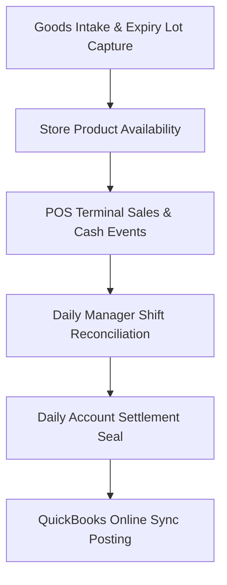

# 01. Getting Started

Status: Validated  
Last Updated: 2026-05-30  
System Area: General  
User Roles: All Roles (Admin, Manager, Accountant, Cashier)

---

## 1. System Overview

**IPOS** is an enterprise-grade Point of Sale (POS) and Store Operations suite designed for modern retail and food-and-beverage environments. The platform is divided into two primary zones:

1. **POS Frontend Terminal**: Optimized for speed, reliability, and ease of use. It operates directly at the checkout registers.
2. **Back Office Administrative Panel**: Scoped for store settings, global inventory control, purchasing, QuickBooks integrations, and daily financial audits.

---

## 2. Zero-Loss Checkout Philosophy

IPOS is engineered to prevent transaction loss and inventory discrepancies under high-stress network conditions. It accomplishes this through three core pillars:

### A. Client-Side Cart Cache (IndexedDB)
If network connectivity drops completely, the POS register stays fully active. Cashiers can continue to browse the local product database, add products to the cart, and cache checkout details in local database storage.

### B. Unique Transaction Identity (UUID)
Every transaction draft is assigned a unique `client_request_uuid` at the moment of scanning. When checkout is submitted, this UUID prevents duplicate sales posting (idempotency guard) even if the cashier clicks the checkout button multiple times or submits the sale twice.

### C. Automatic First-Expired, First-Out (FEFO) Lot Allocation
To eliminate stock spoilage, the system tracks batch expiration dates. When a cashier adds a product to the cart, the system automatically allocates stock from the earliest-expiring batch, ensuring inventory integrity without manual cashier intervention.

---

## 3. High-Level Operations Lifecycle

1. **Goods Received Voucher (GRV)**: Branch Managers record shipments, capturing expiration dates and batch numbers.
2. **Checkout Sales**: Cashiers scan and sell. Stock is depleted using FEFO rules.
3. **Shift Reconciliations**: Managers review cashier closing counts and record final bank deposits.
4. **Settlement Periods**: Accountants lock daily branch sales and push transactional ledgers to QuickBooks.
